# MessageAI - Technical Architecture

## System Overview

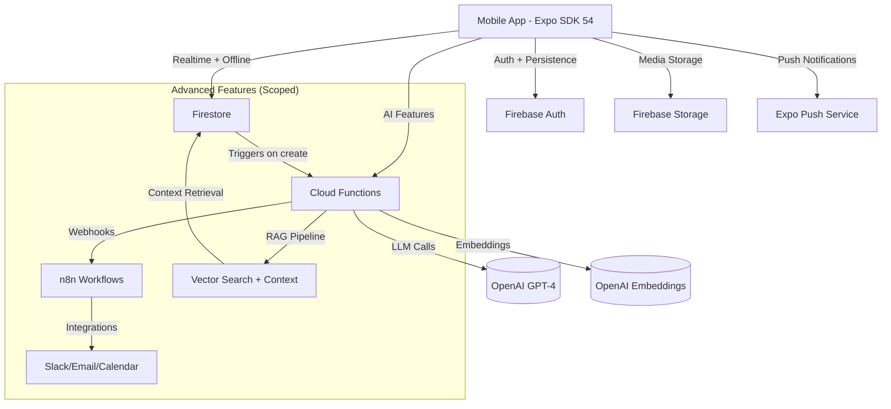
```mermaid
flowchart TD
    A[Mobile App - Expo SDK 54] -->|Auth + Persistence| B[Firebase Auth]
    A -->|Realtime + Offline| C[Firestore]
    A -->|Media Storage| D[Firebase Storage]
    A -->|Push Notifications| E[Expo Push Service]
    A -->|AI Features| F[Cloud Functions]
    F -->|LLM Calls| G[(OpenAI GPT-4)]
    F -->|Embeddings| H[(OpenAI Embeddings)]
    C -->|Triggers on create| F
    
    subgraph "Advanced Features (Scoped)"
        F -->|Webhooks| I[n8n Workflows]
        I -->|Integrations| J[Slack/Email/Calendar]
        F -->|RAG Pipeline| K[Vector Search + Context]
        K -->|Context Retrieval| C
    end
```

## Message Flow with Status Updates

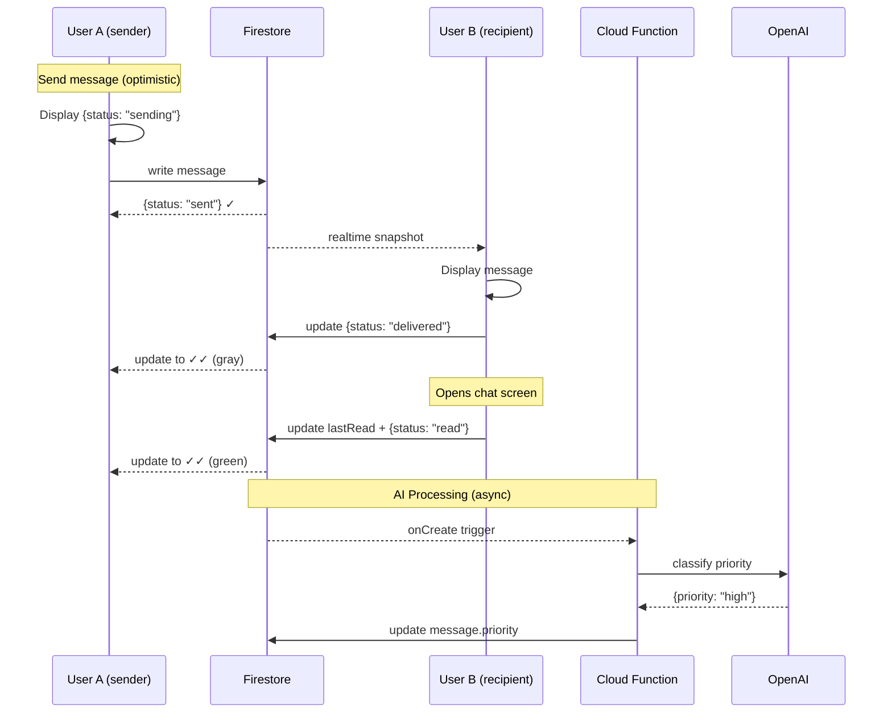
```mermaid
sequenceDiagram
    participant UA as User A (sender)
    participant F as Firestore
    participant UB as User B (recipient)
    participant CF as Cloud Function
    participant AI as OpenAI
    
    Note over UA: Send message (optimistic)
    UA->>UA: Display {status: "sending"}
    UA->>F: write message
    F-->>UA: {status: "sent"} ✓
    F-->>UB: realtime snapshot
    UB->>UB: Display message
    UB->>F: update {status: "delivered"}
    F-->>UA: update to ✓✓ (gray)
    
    Note over UB: Opens chat screen
    UB->>F: update lastRead + {status: "read"}
    F-->>UA: update to ✓✓ (green)
    
    Note over F,CF: AI Processing (async)
    F-->>CF: onCreate trigger
    CF->>AI: classify priority
    AI-->>CF: {priority: "high"}
    CF->>F: update message.priority
```

## Authentication & Multi-User Login

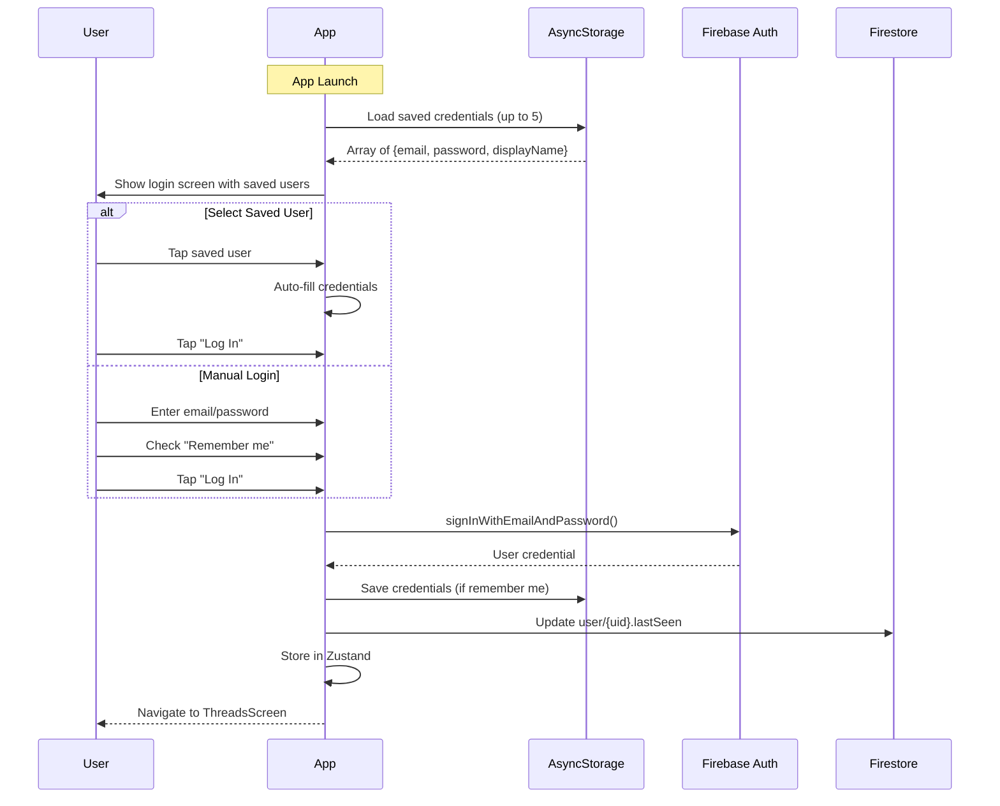
```mermaid
sequenceDiagram
    participant U as User
    participant A as App
    participant AS as AsyncStorage
    participant FA as Firebase Auth
    participant FS as Firestore
    
    Note over A: App Launch
    A->>AS: Load saved credentials (up to 5)
    AS-->>A: Array of {email, password, displayName}
    A->>U: Show login screen with saved users
    
    alt Select Saved User
        U->>A: Tap saved user
        A->>A: Auto-fill credentials
        U->>A: Tap "Log In"
    else Manual Login
        U->>A: Enter email/password
        U->>A: Check "Remember me"
        U->>A: Tap "Log In"
    end
    
    A->>FA: signInWithEmailAndPassword()
    FA-->>A: User credential
    A->>AS: Save credentials (if remember me)
    A->>FS: Update user/{uid}.lastSeen
    A->>A: Store in Zustand
    A-->>U: Navigate to ThreadsScreen
```

## AI Summarization with Caching, Sharing & Smart Titles

**Latest Features (October 2025):**
- ✅ AI-generated contextual titles (extracts key topics from summary)
- ✅ Native share functionality (email, messages, files)
- ✅ Client-side caching (instant re-access without API calls)
- ✅ Re-summarize button to refresh with latest messages

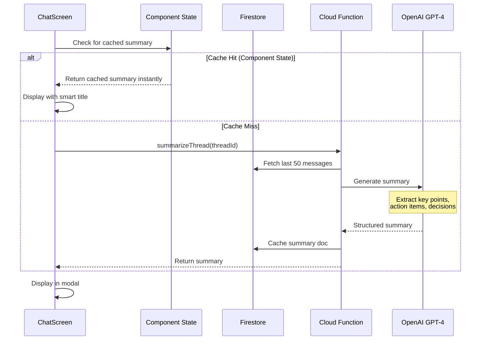
```mermaid
sequenceDiagram
    participant C as ChatScreen
    participant S as Component State
    participant F as Firestore
    participant CF as Cloud Function
    participant AI as OpenAI GPT-4
    
    C->>S: Check for cached summary
    
    alt Cache Hit (Component State)
        S-->>C: Return cached summary instantly
        C->>C: Display with smart title
    else Cache Miss
        C->>CF: summarizeThread(threadId)
        CF->>F: Fetch last 50 messages
        CF->>AI: Generate summary
        Note over AI: Extract key points,<br/>action items, decisions
        AI-->>CF: Structured summary
        CF->>F: Cache summary doc
        CF-->>C: Return summary
    end
    
    C->>C: Display in modal
```

## Offline Message Queue

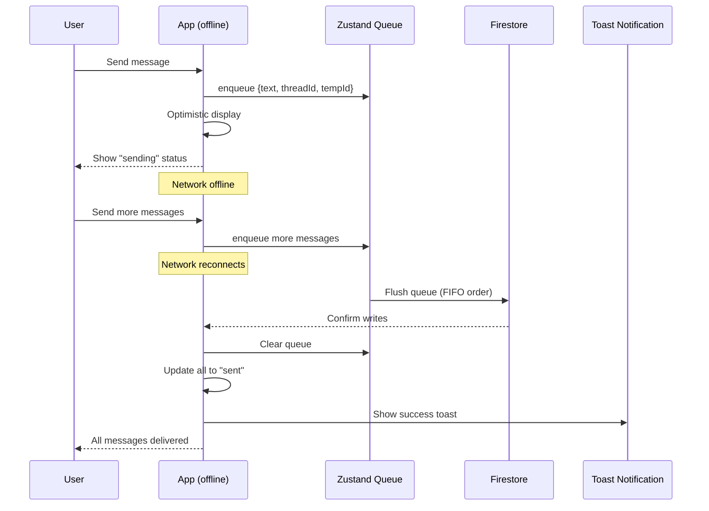
```mermaid
sequenceDiagram
    participant U as User
    participant A as App (offline)
    participant Q as Zustand Queue
    participant F as Firestore
    participant T as Toast Notification
    
    U->>A: Send message
    A->>Q: enqueue {text, threadId, tempId}
    A->>A: Optimistic display
    A-->>U: Show "sending" status
    
    Note over A: Network offline
    U->>A: Send more messages
    A->>Q: enqueue more messages
    
    Note over A: Network reconnects
    Q->>F: Flush queue (FIFO order)
    F-->>A: Confirm writes
    A->>Q: Clear queue
    A->>A: Update all to "sent"
    A->>T: Show success toast
    A-->>U: All messages delivered
```

## Unread Count Calculation

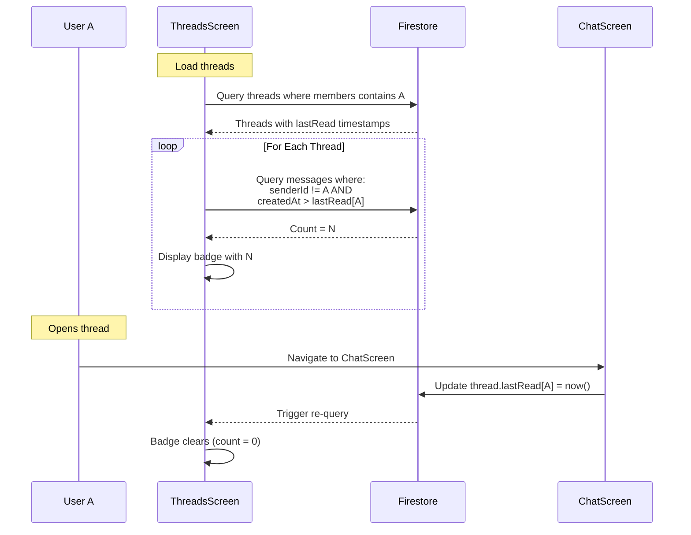
```mermaid
sequenceDiagram
    participant U as User A
    participant TL as ThreadsScreen
    participant F as Firestore
    participant CS as ChatScreen
    
    Note over TL: Load threads
    TL->>F: Query threads where members contains A
    F-->>TL: Threads with lastRead timestamps
    
    loop For Each Thread
        TL->>F: Query messages where:<br/>senderId != A AND<br/>createdAt > lastRead[A]
        F-->>TL: Count = N
        TL->>TL: Display badge with N
    end
    
    Note over U: Opens thread
    U->>CS: Navigate to ChatScreen
    CS->>F: Update thread.lastRead[A] = now()
    F-->>TL: Trigger re-query
    TL->>TL: Badge clears (count = 0)
```

## In-App Toast Notifications

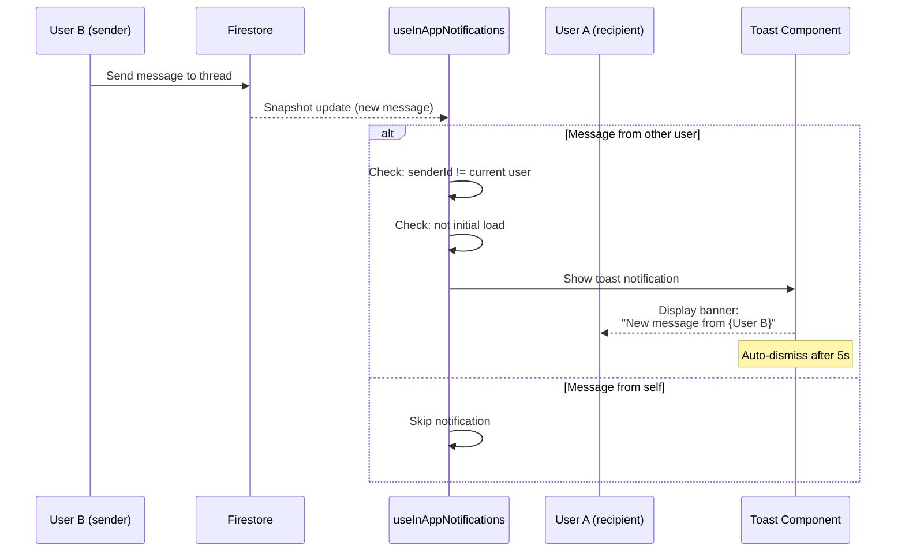
```mermaid
sequenceDiagram
    participant UB as User B (sender)
    participant F as Firestore
    participant Hook as useInAppNotifications
    participant UA as User A (recipient)
    participant Toast as Toast Component
    
    UB->>F: Send message to thread
    F-->>Hook: Snapshot update (new message)
    
    alt Message from other user
        Hook->>Hook: Check: senderId != current user
        Hook->>Hook: Check: not initial load
        Hook->>Toast: Show toast notification
        Toast-->>UA: Display banner:<br/>"New message from {User B}"
        Note over Toast: Auto-dismiss after 5s
    else Message from self
        Hook->>Hook: Skip notification
    end
```

## Group Chat Creation with Duplicate Detection

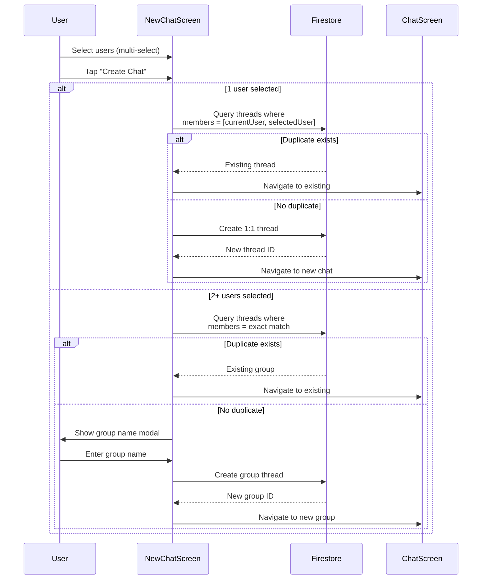
```mermaid
sequenceDiagram
    participant U as User
    participant NC as NewChatScreen
    participant F as Firestore
    participant CS as ChatScreen
    
    U->>NC: Select users (multi-select)
    U->>NC: Tap "Create Chat"
    
    alt 1 user selected
        NC->>F: Query threads where<br/>members = [currentUser, selectedUser]
        
        alt Duplicate exists
            F-->>NC: Existing thread
            NC->>CS: Navigate to existing
        else No duplicate
            NC->>F: Create 1:1 thread
            F-->>NC: New thread ID
            NC->>CS: Navigate to new chat
        end
        
    else 2+ users selected
        NC->>F: Query threads where<br/>members = exact match
        
        alt Duplicate exists
            F-->>NC: Existing group
            NC->>CS: Navigate to existing
        else No duplicate
            NC->>U: Show group name modal
            U->>NC: Enter group name
            NC->>F: Create group thread
            F-->>NC: New group ID
            NC->>CS: Navigate to new group
        end
    end
```

## RAG Pipeline (Scoped for Final Submission)

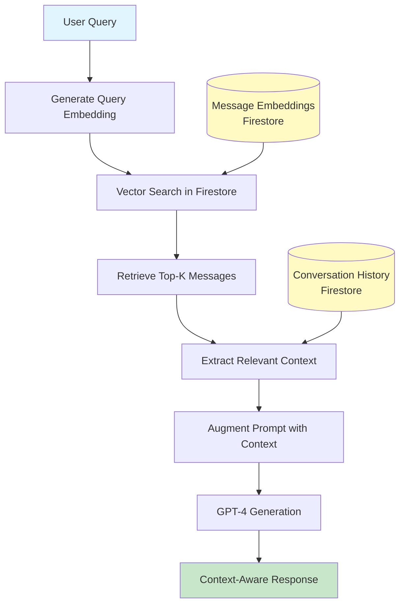
```mermaid
flowchart TD
    A[User Query] --> B[Generate Query Embedding]
    B --> C[Vector Search in Firestore]
    C --> D[Retrieve Top-K Messages]
    D --> E[Extract Relevant Context]
    E --> F[Augment Prompt with Context]
    F --> G[GPT-4 Generation]
    G --> H[Context-Aware Response]
    
    I[(Message Embeddings<br/>Firestore)] --> C
    J[(Conversation History<br/>Firestore)] --> E
    
    style A fill:#e1f5ff
    style H fill:#c8e6c9
    style I fill:#fff9c4
    style J fill:#fff9c4
```

## n8n Workflow Integration (Scoped for Final Submission)

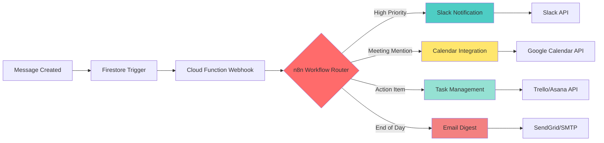
```mermaid
flowchart LR
    A[Message Created] --> B[Firestore Trigger]
    B --> C[Cloud Function Webhook]
    C --> D{n8n Workflow Router}
    
    D -->|High Priority| E[Slack Notification]
    D -->|Meeting Mention| F[Calendar Integration]
    D -->|Action Item| G[Task Management]
    D -->|End of Day| H[Email Digest]
    
    E --> I[Slack API]
    F --> J[Google Calendar API]
    G --> K[Trello/Asana API]
    H --> L[SendGrid/SMTP]
    
    style D fill:#ff6b6b
    style E fill:#4ecdc4
    style F fill:#ffe66d
    style G fill:#95e1d3
    style H fill:#f38181
```

## Data Model (Updated)

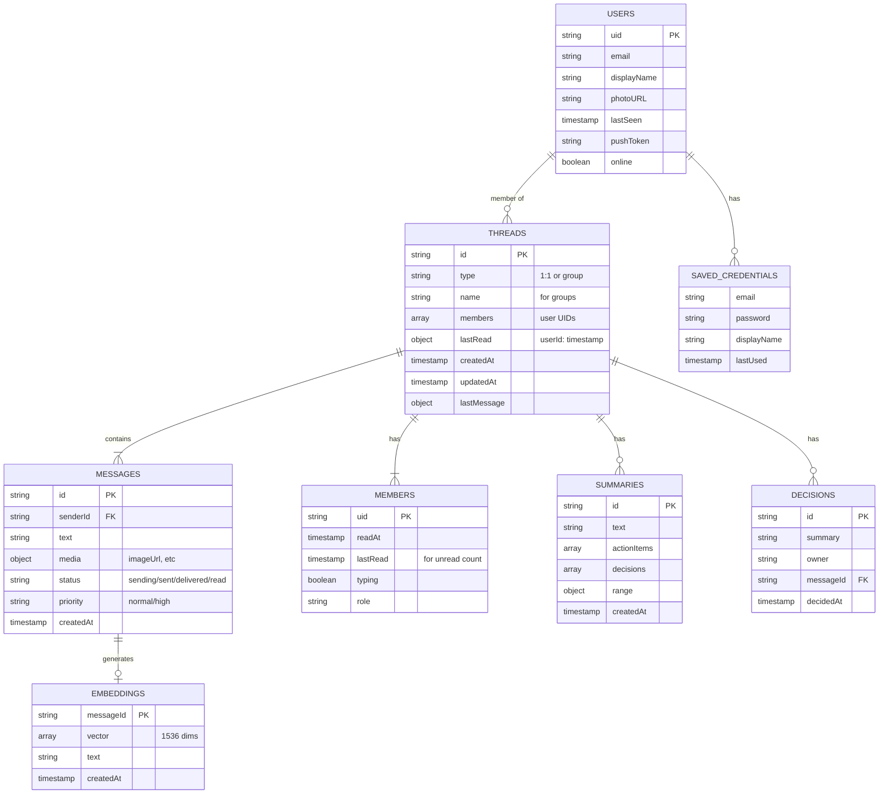
```mermaid
erDiagram
    USERS ||--o{ THREADS : "member of"
    USERS ||--o{ SAVED_CREDENTIALS : has
    THREADS ||--|{ MESSAGES : contains
    THREADS ||--|{ MEMBERS : has
    THREADS ||--o{ SUMMARIES : has
    THREADS ||--o{ DECISIONS : has
    MESSAGES ||--o| EMBEDDINGS : generates
    
    USERS {
        string uid PK
        string email
        string displayName
        string photoURL
        timestamp lastSeen
        string pushToken
        boolean online
    }
    
    SAVED_CREDENTIALS {
        string email
        string password
        string displayName
        timestamp lastUsed
    }
    
    THREADS {
        string id PK
        string type "1:1 or group"
        string name "for groups"
        array members "user UIDs"
        object lastRead "userId: timestamp"
        timestamp createdAt
        timestamp updatedAt
        object lastMessage
    }
    
    MESSAGES {
        string id PK
        string senderId FK
        string text
        object media "imageUrl, etc"
        string status "sending/sent/delivered/read"
        string priority "normal/high"
        timestamp createdAt
    }
    
    MEMBERS {
        string uid PK
        timestamp readAt
        timestamp lastRead "for unread count"
        boolean typing
        string role
    }
    
    SUMMARIES {
        string id PK
        string text
        array actionItems
        array decisions
        object range
        timestamp createdAt
    }
    
    DECISIONS {
        string id PK
        string summary
        string owner
        string messageId FK
        timestamp decidedAt
    }
    
    EMBEDDINGS {
        string messageId PK
        array vector "1536 dims"
        string text
        timestamp createdAt
    }
```

## Component Hierarchy (Updated)

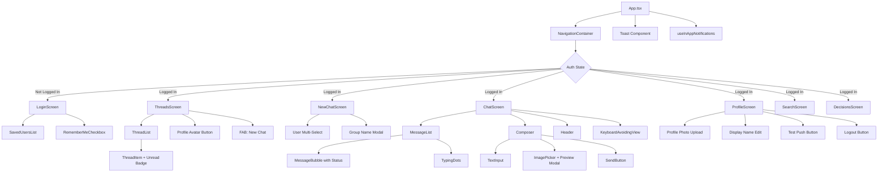
```mermaid
graph TD
    A[App.tsx] --> B[NavigationContainer]
    A --> Z[Toast Component]
    A --> Y[useInAppNotifications]
    
    B --> C{Auth State}
    C -->|Not Logged In| D[LoginScreen]
    C -->|Logged In| E[ThreadsScreen]
    C -->|Logged In| F[ChatScreen]
    C -->|Logged In| G[ProfileScreen]
    C -->|Logged In| NC[NewChatScreen]
    C -->|Logged In| SR[SearchScreen]
    C -->|Logged In| DS[DecisionsScreen]
    
    D --> D1[SavedUsersList]
    D --> D2[RememberMeCheckbox]
    
    E --> H[ThreadList]
    E --> E1[Profile Avatar Button]
    E --> E2[FAB: New Chat]
    H --> I[ThreadItem + Unread Badge]
    
    NC --> NC1[User Multi-Select]
    NC --> NC2[Group Name Modal]
    
    F --> J[MessageList]
    F --> K[Composer]
    F --> L[Header]
    F --> KA[KeyboardAvoidingView]
    J --> M[MessageBubble with Status]
    J --> N[TypingDots]
    
    K --> O[TextInput]
    K --> P[ImagePicker + Preview Modal]
    K --> Q[SendButton]
    
    G --> G1[Profile Photo Upload]
    G --> G2[Display Name Edit]
    G --> G3[Test Push Button]
    G --> G4[Logout Button]
```

## State Management Architecture

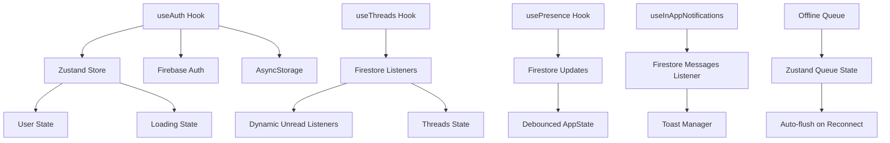
```mermaid
graph TD
    A[Zustand Store] --> B[User State]
    A --> C[Loading State]
    
    D[useAuth Hook] --> A
    D --> E[Firebase Auth]
    D --> AS[AsyncStorage]
    
    F[useThreads Hook] --> G[Firestore Listeners]
    G --> H[Dynamic Unread Listeners]
    G --> I[Threads State]
    
    J[usePresence Hook] --> K[Firestore Updates]
    K --> L[Debounced AppState]
    
    M[useInAppNotifications] --> N[Firestore Messages Listener]
    N --> O[Toast Manager]
    
    P[Offline Queue] --> Q[Zustand Queue State]
    Q --> R[Auto-flush on Reconnect]
```

## Cloud Functions Architecture (Updated)

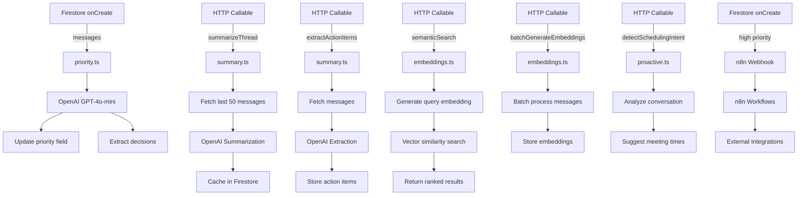
```mermaid
graph TD
    A[Firestore onCreate] -->|messages| B[priority.ts]
    B --> C[OpenAI GPT-4o-mini]
    C --> D[Update priority field]
    C --> E[Extract decisions]
    
    F[HTTP Callable] -->|summarizeThread| G[summary.ts]
    G --> H[Fetch last 50 messages]
    H --> I[OpenAI Summarization]
    I --> J[Cache in Firestore]
    
    K[HTTP Callable] -->|extractActionItems| L[summary.ts]
    L --> M[Fetch messages]
    M --> N[OpenAI Extraction]
    N --> O[Store action items]
    
    P[HTTP Callable] -->|semanticSearch| Q[embeddings.ts]
    Q --> R[Generate query embedding]
    R --> S[Vector similarity search]
    S --> T[Return ranked results]
    
    U[HTTP Callable] -->|batchGenerateEmbeddings| V[embeddings.ts]
    V --> W[Batch process messages]
    W --> X[Store embeddings]
    
    Y[HTTP Callable] -->|detectSchedulingIntent| Z[proactive.ts]
    Z --> AA[Analyze conversation]
    AA --> AB[Suggest meeting times]
    
    AC[Firestore onCreate] -->|high priority| AD[n8n Webhook]
    AD --> AE[n8n Workflows]
    AE --> AF[External Integrations]
```

## Push Notification Flow (Expo)

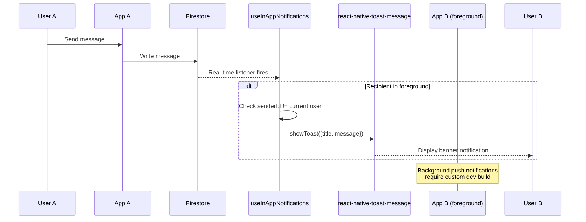
```mermaid
sequenceDiagram
    participant U1 as User A
    participant A1 as App A
    participant FS as Firestore
    participant Hook as useInAppNotifications
    participant Toast as react-native-toast-message
    participant A2 as App B (foreground)
    participant U2 as User B
    
    U1->>A1: Send message
    A1->>FS: Write message
    FS-->>Hook: Real-time listener fires
    
    alt Recipient in foreground
        Hook->>Hook: Check senderId != current user
        Hook->>Toast: showToast({title, message})
        Toast-->>U2: Display banner notification
    end
    
    Note over A2: Background push notifications<br/>require custom dev build
```

## Firebase Security Rules Flow

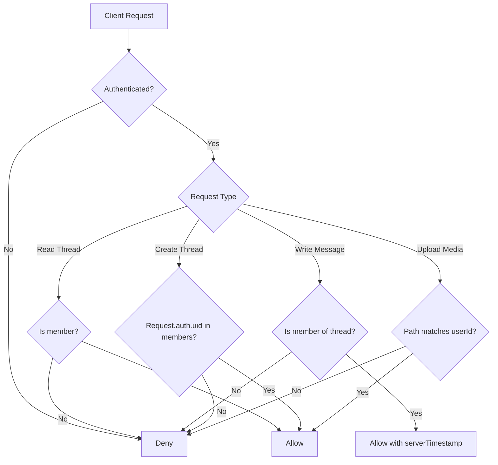
```mermaid
flowchart TD
    A[Client Request] --> B{Authenticated?}
    B -->|No| C[Deny]
    B -->|Yes| D{Request Type}
    
    D -->|Read Thread| E{Is member?}
    E -->|Yes| F[Allow]
    E -->|No| C
    
    D -->|Write Message| G{Is member of thread?}
    G -->|Yes| H[Allow with serverTimestamp]
    G -->|No| C
    
    D -->|Create Thread| I{Request.auth.uid in members?}
    I -->|Yes| F
    I -->|No| C
    
    D -->|Upload Media| J{Path matches userId?}
    J -->|Yes| F
    J -->|No| C
```

## Keyboard Handling (Platform-Specific)

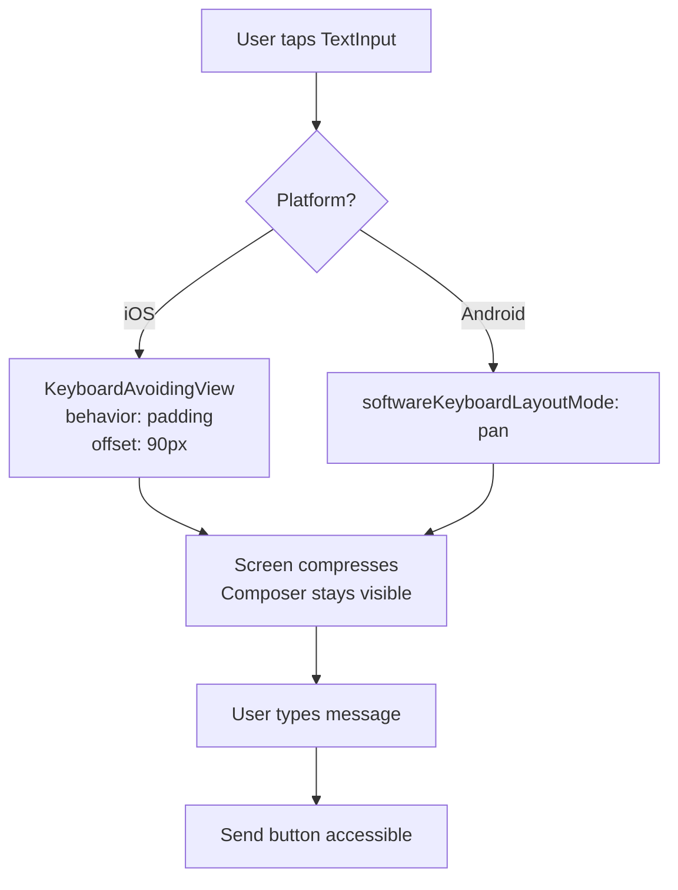
```mermaid
flowchart TD
    A[User taps TextInput] --> B{Platform?}
    
    B -->|iOS| C[KeyboardAvoidingView<br/>behavior: padding<br/>offset: 90px]
    B -->|Android| D[softwareKeyboardLayoutMode: pan]
    
    C --> E[Screen compresses<br/>Composer stays visible]
    D --> E
    
    E --> F[User types message]
    F --> G[Send button accessible]
```

## Image Upload Flow with Preview

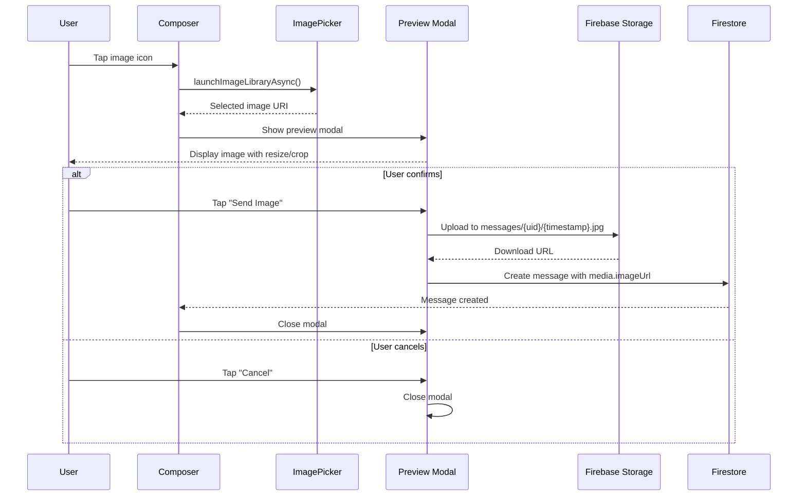
```mermaid
sequenceDiagram
    participant U as User
    participant C as Composer
    participant IP as ImagePicker
    participant M as Preview Modal
    participant FS as Firebase Storage
    participant FD as Firestore
    
    U->>C: Tap image icon
    C->>IP: launchImageLibraryAsync()
    IP-->>C: Selected image URI
    C->>M: Show preview modal
    M-->>U: Display image with resize/crop
    
    alt User confirms
        U->>M: Tap "Send Image"
        M->>FS: Upload to messages/{uid}/{timestamp}.jpg
        FS-->>M: Download URL
        M->>FD: Create message with media.imageUrl
        FD-->>C: Message created
        C->>M: Close modal
    else User cancels
        U->>M: Tap "Cancel"
        M->>M: Close modal
    end
```

## Performance Optimizations

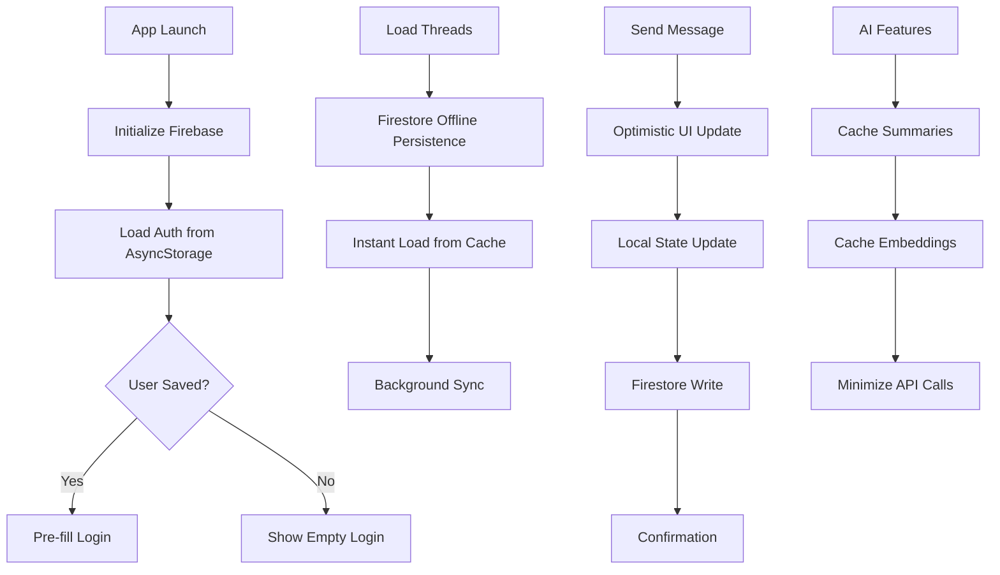
```mermaid
flowchart TD
    A[App Launch] --> B[Initialize Firebase]
    B --> C[Load Auth from AsyncStorage]
    C --> D{User Saved?}
    
    D -->|Yes| E[Pre-fill Login]
    D -->|No| F[Show Empty Login]
    
    G[Load Threads] --> H[Firestore Offline Persistence]
    H --> I[Instant Load from Cache]
    I --> J[Background Sync]
    
    K[Send Message] --> L[Optimistic UI Update]
    L --> M[Local State Update]
    M --> N[Firestore Write]
    N --> O[Confirmation]
    
    P[AI Features] --> Q[Cache Summaries]
    Q --> R[Cache Embeddings]
    R --> S[Minimize API Calls]
```

## Testing Strategy

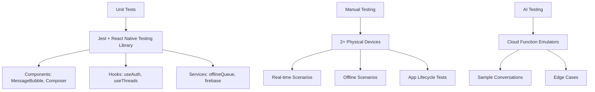
```mermaid
flowchart TD
    A[Unit Tests] --> B[Jest + React Native Testing Library]
    B --> C[Components: MessageBubble, Composer]
    B --> D[Hooks: useAuth, useThreads]
    B --> E[Services: offlineQueue, firebase]
    
    F[Manual Testing] --> G[2+ Physical Devices]
    G --> H[Real-time Scenarios]
    G --> I[Offline Scenarios]
    G --> J[App Lifecycle Tests]
    
    K[AI Testing] --> L[Cloud Function Emulators]
    L --> M[Sample Conversations]
    L --> N[Edge Cases]
```

---

## Technology Stack Summary

| Layer | Technology | Purpose |
|-------|-----------|---------|
| **Frontend** | React Native + Expo SDK 54 | Cross-platform mobile app |
| **Navigation** | React Navigation v6 | Screen routing |
| **State** | Zustand | Global state management |
| **Auth** | Firebase Auth + AsyncStorage | User authentication + persistence |
| **Database** | Firestore | Real-time NoSQL database |
| **Storage** | Firebase Storage | Media file storage |
| **Functions** | Firebase Cloud Functions | Serverless backend |
| **AI/ML** | OpenAI GPT-4o-mini | Text generation |
| **Embeddings** | OpenAI text-embedding-3-small | Vector search |
| **Push** | Expo Push Notifications | Foreground notifications |
| **Testing** | Jest + React Native Testing Library | Unit tests |
| **Workflow** | n8n (scoped) | Automation & integrations |
| **RAG** | Custom pipeline (scoped) | Context-aware AI |

---

## Key Design Decisions

### 1. **Expo vs Native**
**Chosen:** Expo  
**Rationale:** Faster development, built-in modules for notifications/images/storage, easy deployment via Expo Go, still allows custom dev builds when needed.

### 2. **Firebase vs Supabase**
**Chosen:** Firebase  
**Rationale:** Real-time listeners are battle-tested, offline persistence works out-of-the-box, Cloud Functions integrate seamlessly, extensive documentation.

### 3. **Optimistic UI**
**Implementation:** Messages show immediately with "sending" status, then update to "sent" → "delivered" → "read" based on Firestore confirmations.  
**Benefit:** App feels instant even on slow networks.

### 4. **Read Receipts**
**Approach:** Each user has a `lastRead` timestamp per thread. Messages created after this timestamp count as unread. Status updates from "delivered" → "read" when recipient opens the chat.  
**Challenge:** Required dynamic Firestore listeners that refresh when `lastRead` changes.

### 5. **Unread Count Calculation**
**Approach:** For each thread, query messages where `senderId != currentUser` and `createdAt > lastRead[currentUser]`.  
**Optimization:** Firestore composite index on `senderId` + `createdAt` for fast queries.

### 6. **Toast Notifications (Foreground)**
**Approach:** `useInAppNotifications` hook listens for new messages and triggers `react-native-toast-message`.  
**Rationale:** Expo Go doesn't support remote push notifications, but local/toast notifications work perfectly for MVP.

### 7. **Multi-User Login**
**Approach:** Save up to 5 recent credentials in AsyncStorage. Display as a list with avatars.  
**Benefit:** Faster testing with multiple accounts, better UX for shared devices.

### 8. **Duplicate Chat Prevention**
**Approach:** Before creating a thread, query for existing threads with exact member match (using array-contains-all).  
**Benefit:** Prevents clutter, maintains conversation continuity.

### 9. **Image Upload Flow**
**Approach:** ImagePicker → Preview Modal → Confirm → Upload to Storage → Send message with URL.  
**Rationale:** Gives users a chance to review/crop before committing to send.

### 10. **Keyboard Handling**
**Approach:** iOS uses `KeyboardAvoidingView` with padding, Android uses native `pan` mode via `app.json`.  
**Challenge:** Took several iterations to get right for both platforms.

---

## Security Considerations

### Firestore Rules
- Users can only read threads they're members of
- Message creation requires membership verification
- Server timestamps are enforced (prevent time manipulation)
- Cloud Functions run with elevated permissions

### Storage Rules
- Media uploads restricted to authenticated users
- Upload path must match user's UID (prevents spoofing)
- Delete/write only by owner

### API Keys
- OpenAI key stored in Cloud Functions config (never exposed to client)
- Firebase config in `.env` (gitignored, not sensitive)
- Push tokens stored securely in Firestore

### Privacy
- Messages encrypted in transit (HTTPS)
- Messages encrypted at rest (Firebase default)
- AI processing: only last 50 messages sent to OpenAI
- No long-term storage by OpenAI (per their policy)

---

## Future Architecture Enhancements

### Phase 2: Production Scalability
- Firestore partitioning for large threads
- CDN for media delivery (Firebase hosting)
- Background push notifications (custom dev build)
- Message pagination (currently loads all)

### Phase 3: Advanced Features
- End-to-end encryption (E2EE) - requires custom crypto layer
- Voice/video calls (WebRTC + Agora/Twilio)
- Message reactions (emoji subcollection)
- Thread pinning (priority flag + sorting)

### Phase 4: Enterprise Features
- SSO integration (SAML/OAuth)
- Audit logs (compliance)
- Data export (GDPR)
- Custom deployment (on-premise Firebase emulators)

---

*This architecture supports the current MVP and scales to enterprise needs.*

