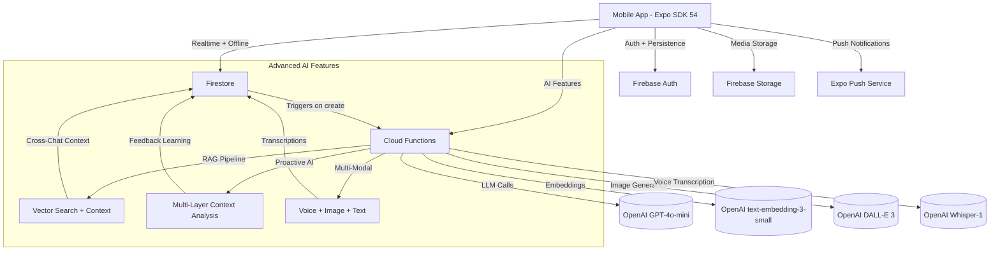
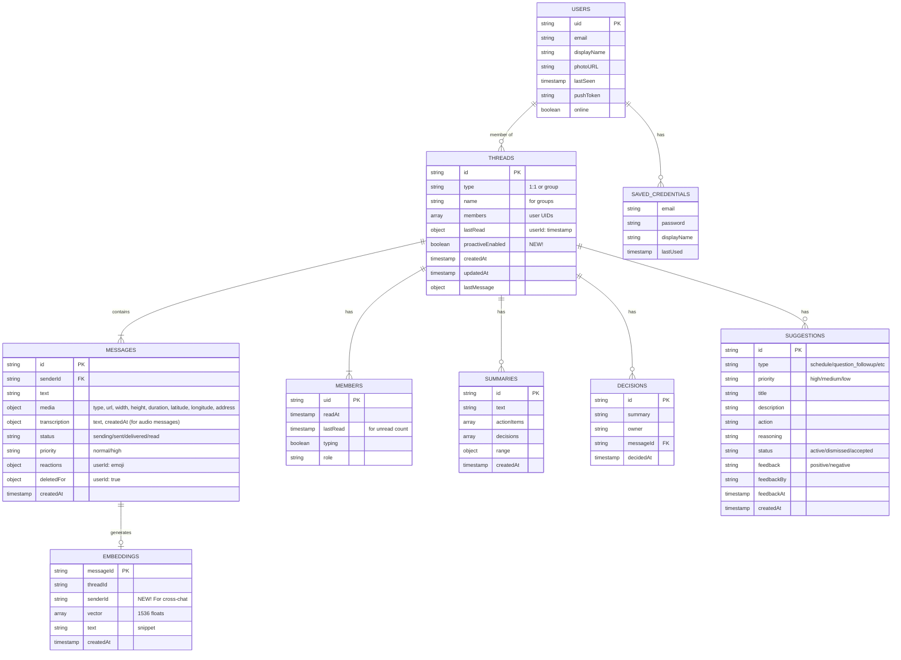
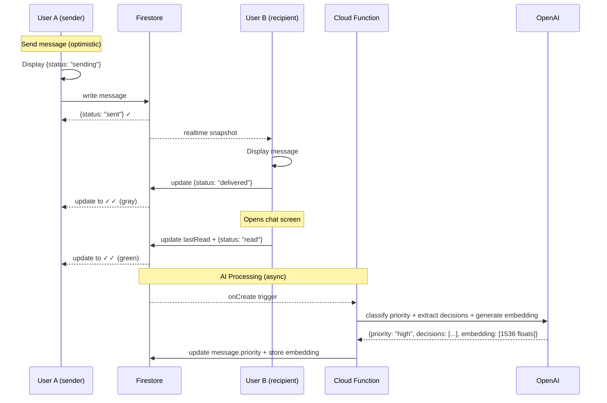
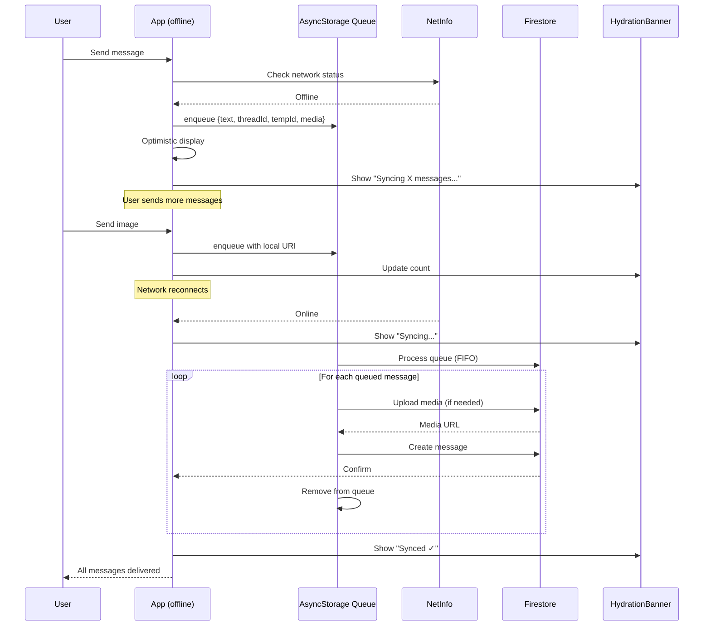
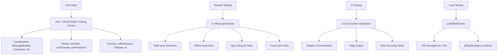

# 🏗️ MessageAI - Complete Technical Architecture

**Last Updated:** October 23, 2025  
**System Complexity:** Advanced Multi-Layer RAG with Cross-Chat Context + Multi-Modal AI  
**Status:** Production-Ready MVP with 7/7 AI Features + Voice Transcription + Image Generation

---

## 📊 System Overview



---

## 🧠 AI System Architecture (The Crown Jewel)

### High-Level AI Data Flow

```
┌─────────────────────────────────────────────────────────────────────────┐
│                         MESSAGEAI AI SYSTEM                              │
│                                                                          │
│  ┌────────────────┐      ┌──────────────────┐      ┌─────────────────┐ │
│  │  React Native  │◄────►│  Firebase Cloud  │◄────►│    OpenAI API   │ │
│  │     Client     │      │    Functions     │      │   GPT-4o-mini   │ │
│  └────────────────┘      └──────────────────┘      └─────────────────┘ │
│          │                        │                          │          │
│          │                        ▼                          │          │
│          │              ┌──────────────────┐                 │          │
│          └─────────────►│    Firestore     │◄────────────────┘          │
│                         │   (Database +    │                            │
│                         │   Embeddings)    │                            │
│                         └──────────────────┘                            │
└─────────────────────────────────────────────────────────────────────────┘
```

### Message Creation & Automatic AI Processing

```
User sends message
       │
       ▼
┌──────────────────────────────────────────────────────────────────┐
│ 1. Firestore Trigger: messageCreated                             │
│    Location: firebase/functions/src/priority.ts                  │
└──────────────────────────────────────────────────────────────────┘
       │
       ├─► Priority Detection (GPT-4o-mini)
       │   ├─► Analyzes: urgency, keywords, context
       │   └─► Returns: "high" or "normal"
       │
       ├─► Decision Extraction (GPT-4o-mini)
       │   ├─► Looks for: commitments, choices, approvals
       │   └─► Stores: decisions subcollection
       │
       └─► Embedding Generation (OpenAI text-embedding-3-small)
           ├─► Input: message text + senderId
           ├─► Output: 1536-dimensional vector
           └─► Stores: embeddings collection
                ├─► messageId
                ├─► threadId
                ├─► senderId ← NEW! For cross-chat context
                ├─► vector (1536 floats)
                ├─► text (snippet)
                └─► createdAt
```

---

## 🎯 AI Features Deep Dive

### Feature 1: Thread Summarization

```
User clicks "Summarize" or types /summarize
       │
       ▼
┌──────────────────────────────────────────────────────────────────┐
│ Function: summarize (firebase/functions/src/summary.ts)          │
└──────────────────────────────────────────────────────────────────┘
       │
       ├─► Fetch last 30 messages from thread
       │
       ├─► Fetch user display names (batch lookup)
       │
       ├─► RAG: Get thread-specific context (optional, disabled for speed)
       │   └─► Query: "conversation summary key topics decisions"
       │       └─► Returns: Top 3 relevant historical messages
       │
       ├─► Build prompt with context
       │   ├─► Recent messages (up to 4000 chars)
       │   └─► Historical context (if RAG enabled)
       │
       ├─► Call GPT-4o-mini
       │   ├─► Model: gpt-4o-mini
       │   ├─► Temperature: 0.7
       │   └─► Max tokens: 2000
       │
       └─► Store summary in Firestore
           └─► threads/{threadId}/summaries/{summaryId}
```

**Client-Side UX:**
- ✅ AI Streaming Simulation (🔍→📊→🤖→✨→📝)
- ✅ Rate Limiting (20 calls / 10 minutes)
- ✅ Scrollable modal with 2000 token output
- ✅ Slash command: `/summarize`

---

### Feature 2: Action Items & Decisions Extraction

```
User clicks "Action Items" or types /actions
       │
       ▼
┌──────────────────────────────────────────────────────────────────┐
│ Function: extract (firebase/functions/src/summary.ts)            │
└──────────────────────────────────────────────────────────────────┘
       │
       ├─► Fetch last 30 messages from thread
       │
       ├─► Fetch user display names
       │
       ├─► RAG: Get action/decision context (optional)
       │   └─► Query: "action items decisions tasks assignments"
       │
       ├─► Build structured prompt
       │   └─► Requests JSON: {actionItems: [...], decisions: [...]}
       │
       ├─► Call GPT-4o-mini with JSON mode
       │   ├─► response_format: { type: 'json_object' }
       │   └─► Temperature: 0.3 (more deterministic)
       │
       └─► Parse and store results
           └─► Returns: {actionItems, decisions}
```

**Client-Side UX:**
- ✅ Structured display with assignees and due dates
- ✅ Refresh button on DecisionsScreen
- ✅ Share functionality (native share sheet)
- ✅ Slash commands: `/actions`, `/decisions`

---

### Feature 3: Semantic Search (RAG-Powered)

```
User types search query: "What did we decide about the deadline?"
       │
       ▼
┌──────────────────────────────────────────────────────────────────┐
│ Function: search (firebase/functions/src/embeddings.ts)          │
└──────────────────────────────────────────────────────────────────┘
       │
       ├─► Generate query embedding
       │   ├─► Model: text-embedding-3-small
       │   └─► Output: 1536-dim vector
       │
       ├─► Fetch all embeddings for thread
       │   └─► Filter: threadId == current thread
       │       └─► Limit: 1000 embeddings
       │
       ├─► Calculate cosine similarity
       │   └─► For each embedding:
       │       └─► similarity = dot(queryVector, messageVector) / (||q|| * ||m||)
       │
       ├─► Sort by similarity (highest first)
       │
       └─► Return top 10 results
           └─► Each result: {messageId, text, similarity}
```

**Cosine Similarity Math:**
```
similarity = (A · B) / (||A|| × ||B||)

Where:
- A · B = dot product (sum of element-wise multiplication)
- ||A|| = magnitude of vector A = sqrt(sum of squares)
- Result: -1 to 1 (1 = identical, 0 = unrelated, -1 = opposite)
```

**Client-Side UX:**
- ✅ SearchScreen with real-time results
- ✅ Similarity scores displayed
- ✅ Tap to jump to message in thread
- ✅ Slash command: `/search <query>`

---

### Feature 4: Priority Detection (Automatic)

```
Message arrives → Firestore trigger
       │
       ▼
┌──────────────────────────────────────────────────────────────────┐
│ Inline in messageCreated trigger                                 │
└──────────────────────────────────────────────────────────────────┘
       │
       ├─► Build classification prompt
       │   └─► Looks for: URGENT, ASAP, blocking issues, questions
       │
       ├─► Call GPT-4o-mini
       │   ├─► Model: gpt-4o-mini
       │   ├─► Temperature: 0.3
       │   └─► Returns: {priority: "high" | "normal", decisions: [...]}
       │
       └─► Update message document
           └─► Set priority field
               └─► UI shows red "!" badge for "high" priority
```

**Client-Side UX:**
- ✅ Red priority badge on high-priority messages
- ✅ No user interaction required (fully automatic)
- ✅ Works in real-time as messages arrive

---

### Feature 5: Decision Tracking

```
Decisions extracted in 2 ways:

1. Inline during message creation (priority.ts)
   └─► Stores: threads/{threadId}/decisions/{decisionId}

2. Batch extraction via "Action Items" button (summary.ts)
   └─► Returns: decisions array

User views decisions:
   └─► DecisionsScreen.tsx
       ├─► Fetches: threads/{threadId}/decisions
       ├─► Groups by: date/owner
       └─► Actions: Refresh, Share
```

**Client-Side UX:**
- ✅ Dedicated DecisionsScreen
- ✅ Refresh button with streaming simulation
- ✅ Share button (native share sheet)
- ✅ Slash command: `/decisions`

---

### Feature 6: Proactive AI Assistant (MOST COMPLEX!)

```
User sends message → 5 second debounce → Analyze
       │
       ▼
┌──────────────────────────────────────────────────────────────────┐
│ Function: analyzeContext (firebase/functions/src/proactive.ts)   │
│ THE CROWN JEWEL - Multi-Layer RAG with Cross-Chat Context        │
└──────────────────────────────────────────────────────────────────┘
       │
       ├─► Check if proactive AI enabled for thread
       │   └─► Firestore: threads/{threadId}.proactiveEnabled
       │
       ├─► Fetch last 20 messages from thread
       │
       ├─► LAYER 1: Thread-Specific RAG Context
       │   └─► getRelevantContext(
       │         query: "important context decisions actions questions",
       │         threadId: currentThread,
       │         limit: 3
       │       )
       │       └─► Returns: Top 3 relevant messages from THIS chat
       │
       ├─► LAYER 2: User-Specific Cross-Chat Context ← NEW!
       │   └─► For each participant (up to 3 users):
       │       └─► getRelevantContext(
       │             query: "important patterns preferences style",
       │             threadId: "", ← Empty = ALL THREADS!
       │             limit: 2,
       │             senderId: userId ← Filter by specific user
       │           )
       │           └─► Returns: Top 2 messages from this user across ALL chats
       │               └─► Learns: communication style, preferences, patterns
       │
       ├─► LAYER 3: Feedback Learning Context
       │   └─► Fetch: threads/{threadId}/suggestions
       │       └─► Filter: feedback != null
       │       └─► Analyze: Which suggestion types got thumbs up?
       │       └─► Example: "Users in this thread liked: scheduling, drafts"
       │
       ├─► Build mega-prompt with ALL context layers
       │   ├─► Recent conversation (4000 chars)
       │   ├─► Thread history (Layer 1)
       │   ├─► User patterns (Layer 2)
       │   └─► Feedback preferences (Layer 3)
       │
       ├─► Call GPT-4o-mini
       │   ├─► Analyzes for 6 types:
       │   │   1. schedule - Meeting/call coordination
       │   │   2. question_followup - Unanswered questions
       │   │   3. action_reminder - Tasks needing attention
       │   │   4. draft_message - Suggested replies
       │   │   5. info_gap - Missing context
       │   │   6. decision_prompt - Moments needing decisions
       │   │
       │   └─► Returns: {
       │         hasSuggestion: true,
       │         type: "schedule",
       │         priority: "high",
       │         title: "Schedule meeting",
       │         description: "Team discussing deadlines",
       │         action: "Suggest: Tuesday 2pm or Wednesday 10am",
       │         reasoning: "Multiple time mentions detected"
       │       }
       │
       └─► Store suggestion
           └─► threads/{threadId}/suggestions/{suggestionId}
               ├─► ...all fields above
               ├─► status: "active" | "dismissed" | "accepted"
               ├─► feedback: null | "positive" | "negative"
               └─► createdAt

User sees animated pill above composer:
   ├─► Tap to expand (future)
   ├─► Thumbs up/down → Updates feedback field
   └─► Dismiss (X) → Sets status: "dismissed"
```

**Client-Side UX:**
- ✅ Animated suggestion pill (slides up from bottom)
- ✅ Priority-based colors (red/orange/blue)
- ✅ Thumbs up/down feedback buttons
- ✅ Dismiss button (X)
- ✅ Opt-in toggle in thread settings (iOS-style switch)
- ✅ Manual trigger in AI menu
- ✅ Expandable modal for long suggestions with scrollable content

---

### Feature 7: AI Image Generation

```
User types /generate or clicks "Generate Image" in AI menu
       │
       ▼
┌──────────────────────────────────────────────────────────────────┐
│ Function: generate (firebase/functions/src/imageGeneration.ts)   │
└──────────────────────────────────────────────────────────────────┘
       │
       ├─► Validate prompt (non-empty)
       │
       ├─► Call OpenAI DALL-E 3 API
       │   ├─► Model: dall-e-3
       │   ├─► Size: 1024x1024 (default)
       │   ├─► Quality: standard
       │   └─► Returns: {imageUrl, revisedPrompt}
       │
       ├─► Return image URL to client
       │
       └─► Client downloads and uploads to Firebase Storage
           └─► Sends as regular message with media type "image"
```

**Client-Side UX:**
- ✅ Slash command: `/generate <prompt>`
- ✅ Modal with prompt input and loading state
- ✅ Toast notifications (Generating → Uploading → Complete)
- ✅ Rate limiting (counts toward 20 calls/10 min)
- ✅ Generated images preserve aspect ratio with max 300x300 dimensions
- ✅ Full-screen viewer with zoom/pan/save/share

---

### Bonus Feature: Voice Message Transcription

```
User sends voice message → Firestore trigger
       │
       ▼
┌──────────────────────────────────────────────────────────────────┐
│ Trigger: audioMessageCreated (firebase/functions/src/transcription.ts) │
└──────────────────────────────────────────────────────────────────┘
       │
       ├─► Download audio file from Firebase Storage
       │
       ├─► Call OpenAI Whisper API
       │   ├─► Model: whisper-1
       │   ├─► Language: auto-detect
       │   └─► Returns: {text: "transcription"}
       │
       ├─► Update message document
       │   └─► Add transcription field: {text, createdAt}
       │
       └─► Generate embedding for transcription
           └─► Makes voice messages searchable via semantic search!

Manual transcription also available:
   └─► User taps text icon on audio message
       └─► Calls transcribe() Cloud Function
           └─► Same flow as automatic
```

**Client-Side UX:**
- ✅ Automatic transcription for all NEW voice messages
- ✅ Manual transcription button (text icon) for existing messages
- ✅ Inline transcription display below audio player
- ✅ Loading spinner during transcription
- ✅ Transcriptions indexed in RAG for semantic search
- ✅ Transcriptions included in summaries and action items

---

### Bonus Feature: Advanced Image Handling

**Full-Screen Image Viewer:**
- ✅ Tap any image to open full-screen viewer
- ✅ Pinch-to-zoom and pan gestures
- ✅ Save to device gallery (with permissions)
- ✅ Share via native share sheet
- ✅ Close button to return to chat

**Image Preview Modal:**
- ✅ Review images before sending
- ✅ Add caption for all images
- ✅ User-controlled compression (High/Medium/Low)
- ✅ File size display for each quality level
- ✅ Cancel or Send actions

**Multi-Image Selection:**
- ✅ Select up to 10 images at once
- ✅ Horizontal gallery preview
- ✅ Single caption for all images
- ✅ Batch upload with progress tracking

**Camera Integration:**
- ✅ Take photos directly in-app
- ✅ Instant preview before sending
- ✅ Same compression options as gallery

**Location Sharing:**
- ✅ Send current location with one tap
- ✅ Reverse geocoding for address
- ✅ Google/Apple Maps integration
- ✅ Display: map link + address + coordinates

---

## 🔍 RAG Query Patterns

### Pattern 1: Thread-Specific Search
```typescript
getRelevantContext(
  query: "What did we decide about X?",
  threadId: "abc123",  // ← Specific thread
  limit: 10
)
// Returns: Top 10 messages from THIS thread only
```

### Pattern 2: Cross-Chat User Search (NEW!)
```typescript
getRelevantContext(
  query: "user communication patterns",
  threadId: "",  // ← Empty = ALL threads
  limit: 5,
  senderId: "user123"  // ← Specific user
)
// Returns: Top 5 messages from this user across ALL chats
// Use case: Learn user's style, preferences, typical responses
```

### Pattern 3: Global Search
```typescript
getRelevantContext(
  query: "project deadlines",
  threadId: "",  // ← Empty = ALL threads
  limit: 20
)
// Returns: Top 20 messages about deadlines from ANY chat
// Use case: Find information regardless of where it was discussed
```

---

## 🗄️ Complete Data Model



---

## 📱 Message Flow with Status Updates



---

## 🔄 Offline Message Queue



---

## 🧪 AI Streaming Simulation (Client-Side UX)

```
User triggers AI feature
       │
       ▼
Client starts streaming simulation
       │
       ├─► Step 1: "🔍 Analyzing conversation..." (0.75s)
       ├─► Step 2: "📊 Processing messages..." (0.75s)
       ├─► Step 3: "🤖 Generating insights..." (0.75s)
       ├─► Step 4: "✨ Finalizing results..." (0.75s)
       └─► Step 5: "📝 Almost done..." (0.75s)
       
       ▼
Cloud Function returns actual result
       │
       └─► Immediately replace streaming message with real output
```

**Benefits:**
- ✅ Makes 2-4 second waits feel faster
- ✅ Shows progress to user
- ✅ Can be cancelled if result arrives early
- ✅ No backend changes required

---

## ⚡ Performance Optimizations

### Speed Optimizations
- ✅ Reduced message limit: 50 → 30 messages
- ✅ Shorter prompts: 6000 → 4000 chars
- ✅ RAG disabled by default (optional flag)
- ✅ Temperature tuning: 0.7 for creative, 0.3 for structured
- ✅ Parallel user lookups: `Promise.all()`
- ✅ Firestore offline persistence (instant cache reads)
- ✅ Image compression before upload

### Cost Optimizations
- ✅ Client-side rate limiting: 20 calls / 10 minutes
- ✅ Embedding caching: Never re-embed same message
- ✅ Semantic search: No API calls (local cosine similarity)
- ✅ Model choice: gpt-4o-mini (cheapest GPT-4 class model)
- ✅ Analytics tracking: AsyncStorage (no backend calls)

### Reliability
- ✅ Automatic retry: 2 attempts with exponential backoff
- ✅ Graceful degradation: Falls back if RAG fails
- ✅ Error boundaries: UI doesn't crash on AI errors
- ✅ Toast notifications: Clear user feedback
- ✅ Offline queue: Messages never lost

---

## 🎨 Component Hierarchy

```mermaid
graph TD
    A[App.tsx] --> B[NavigationContainer]
    A --> Z[Toast Component]
    A --> Y[useInAppNotifications]
    A --> EB[ErrorBoundary]
    
    B --> C{Auth State}
    C -->|Not Logged In| D[LoginScreen]
    C -->|Logged In| E[ThreadsScreen]
    C -->|Logged In| F[ChatScreen]
    C -->|Logged In| G[ProfileScreen]
    C -->|Logged In| NC[NewChatScreen]
    C -->|Logged In| SR[SearchScreen]
    C -->|Logged In| DS[DecisionsScreen]
    C -->|Logged In| LT[LoadTestScreen]
    
    D --> D1[SavedUsersList]
    D --> D2[RememberMeCheckbox]
    
    E --> H[ThreadList]
    E --> E1[Profile Avatar Button]
    E --> E2[FAB: New Chat]
    E --> HB[HydrationBanner]
    H --> I[ThreadItem + Unread Badge]
    
    NC --> NC1[User Multi-Select]
    NC --> NC2[Group Name Modal]
    
    F --> J[MessageList]
    F --> K[Composer]
    F --> L[Header with Settings]
    F --> KA[KeyboardAvoidingView]
    F --> PSP[ProactiveSuggestionPill]
    J --> M[MessageBubble with Status]
    J --> N[TypingDots]
    
    K --> O[TextInput with Slash Commands]
    K --> P[ImagePicker + Preview Modal]
    K --> Q[SendButton]
    K --> R[AudioRecorder]
    
    G --> G1[Profile Photo Upload]
    G --> G2[Display Name Edit]
    G --> G3[Test Push Button]
    G --> G4[Logout Button]
    
    F --> AM[AIMenu Modal]
    AM --> AM1[Summarize]
    AM --> AM2[Action Items]
    AM --> AM3[Semantic Search]
    AM --> AM4[Decisions]
    AM --> AM5[Proactive AI]
    AM --> AM6[Rate Limit Badge]
```



---

## 🔐 Security Architecture

### Firestore Rules
```javascript
// Users can only read threads they're members of
match /threads/{threadId} {
  allow read: if request.auth.uid in resource.data.members;
  allow write: if request.auth.uid in request.resource.data.members;
}

// Message creation requires membership
match /threads/{threadId}/messages/{messageId} {
  allow read: if request.auth.uid in get(/databases/$(database)/documents/threads/$(threadId)).data.members;
  allow create: if request.auth.uid in get(/databases/$(database)/documents/threads/$(threadId)).data.members;
}
```

### Storage Rules
```javascript
// Media uploads restricted to authenticated users
match /messages/{userId}/{allPaths=**} {
  allow read: if request.auth != null;
  allow write: if request.auth.uid == userId;
}
```

### API Keys
- ✅ OpenAI key stored in Cloud Functions config (never exposed to client)
- ✅ Firebase config in `.env` (gitignored, not sensitive)
- ✅ Push tokens redacted in logs (`[REDACTED]`)

### Privacy
- ✅ Messages encrypted in transit (HTTPS)
- ✅ Messages encrypted at rest (Firebase default)
- ✅ AI processing: only last 30 messages sent to OpenAI
- ✅ No long-term storage by OpenAI (per their policy)
- ✅ Embeddings contain snippets (max 500 chars)

---

## 🧪 Testing Strategy



**Test Coverage:** 63/63 tests passing ✅

---

## 📊 Technology Stack

| Layer | Technology | Purpose |
|-------|-----------|---------|
| **Frontend** | React Native + Expo SDK 54 | Cross-platform mobile app |
| **Navigation** | React Navigation v6 | Screen routing |
| **State** | Zustand + React Context | Global state management |
| **Auth** | Firebase Auth + AsyncStorage | User authentication + persistence |
| **Database** | Firestore | Real-time NoSQL database |
| **Storage** | Firebase Storage | Media file storage |
| **Functions** | Firebase Cloud Functions (Node 20) | Serverless backend |
| **AI Text** | OpenAI GPT-4o-mini | Text generation & classification |
| **AI Images** | OpenAI DALL-E 3 | Image generation from prompts |
| **AI Voice** | OpenAI Whisper-1 | Voice message transcription |
| **Embeddings** | OpenAI text-embedding-3-small | Vector search (1536-dim) |
| **Push** | Expo Push Notifications | Foreground notifications |
| **Media** | expo-image-picker, expo-av, expo-location | Camera, audio, location |
| **Image Viewing** | react-native-image-viewing, expo-media-library | Full-screen viewer, save/share |
| **Testing** | Jest + React Native Testing Library | Unit tests |
| **CI/CD** | GitHub Actions | Lint, typecheck, build |
| **Linting** | ESLint + TypeScript | Code quality |

---

## 🚀 Key Design Decisions

### 1. **Expo vs Native**
**Chosen:** Expo  
**Rationale:** Faster development, built-in modules, easy deployment via Expo Go.

### 2. **Firebase vs Supabase**
**Chosen:** Firebase  
**Rationale:** Real-time listeners, offline persistence, Cloud Functions integration.

### 3. **Optimistic UI**
**Implementation:** Messages show immediately with "sending" status.  
**Benefit:** App feels instant even on slow networks.

### 4. **Read Receipts**
**Approach:** `lastRead` timestamp per user per thread.  
**Challenge:** Required dynamic Firestore listeners.

### 5. **Multi-Layer RAG**
**Innovation:** Thread-specific + user-specific + feedback learning context.  
**Benefit:** AI understands users globally, not just per-thread.

### 6. **Client-Side Rate Limiting**
**Approach:** AsyncStorage tracks AI calls (20 / 10 minutes).  
**Benefit:** Prevents API abuse, saves costs.

### 7. **AI Streaming Simulation**
**Approach:** Progressive loading messages (🔍→📊→🤖→✨→📝).  
**Benefit:** Makes 2-4 second waits feel faster.

### 8. **Voice Transcription Strategy**
**Approach:** Automatic transcription via Firestore trigger + manual on-demand.  
**Benefit:** All new voice messages searchable, old messages transcribable on request.

### 9. **Multi-Modal AI Integration**
**Approach:** Voice transcriptions indexed in RAG, included in summaries/actions.  
**Benefit:** AI features work across text, voice, and image content.

### 10. **Image Handling Philosophy**
**Approach:** User-controlled compression, multi-select, preview before send.  
**Benefit:** Balance between quality and performance, user has full control.

### 11. **Location Sharing**
**Approach:** Reverse geocoding for human-readable addresses + map links.  
**Benefit:** Users get context (address) not just coordinates.

### 12. **Offline Queue with Media**
**Approach:** AsyncStorage queue with retry logic, supports images/audio.  
**Benefit:** Messages never lost, even with force-quit.

### 13. **Slash Commands**
**Approach:** Text input parsing with autocomplete menu.  
**Benefit:** Power users can trigger AI features instantly.

### 14. **Feedback Learning**
**Approach:** Thumbs up/down on suggestions, stored in Firestore.  
**Benefit:** AI improves over time based on user preferences.

---

## 🎯 Conflict Resolution Strategy

MessageAI uses a **last-write-wins** strategy with immutable messages:

1. **Messages are immutable** - Once sent, text cannot be edited
2. **Deletions are per-user** - `deletedFor: {userId: true}` allows "delete for me" or "delete for everyone"
3. **Reactions overwrite** - Latest reaction emoji replaces previous
4. **Read receipts use timestamps** - `lastRead` timestamp per user, latest wins
5. **Offline writes are FIFO** - Queue processes in order, no conflicts

**No complex conflict resolution needed** because:
- Messages don't merge (append-only log)
- Firestore handles concurrent writes with server timestamps
- Offline queue ensures FIFO order

---

## 🔮 Future Enhancements

### Phase 2: Advanced AI
- [ ] Voice message transcription (Whisper API)
- [ ] Image analysis (GPT-4 Vision)
- [ ] Multi-language support
- [ ] Sentiment analysis
- [ ] Smart replies

### Phase 3: Rich Media
- [ ] Camera access (take photos in-app)
- [ ] Location sharing (Google/Apple Maps)
- [ ] AI image generation (DALL-E)
- [ ] GIF support
- [ ] Video messages

### Phase 4: Enterprise
- [ ] Google Sign-In
- [ ] SSO integration (SAML/OAuth)
- [ ] Audit logs
- [ ] Data export (GDPR)
- [ ] End-to-end encryption

### Phase 5: Scalability
- [ ] Message pagination (currently loads all)
- [ ] CDN for media delivery
- [ ] Background push notifications (custom dev build)
- [ ] Firestore partitioning for large threads

---

## 🎭 Bonus Feature Idea: "Seinfeld Mode"

**Concept:** Four AI agent accounts based on Jerry, George, Elaine, and Kramer that users can interact with.

### Implementation Strategy

```
1. Create 4 Firebase accounts:
   - jerry@vandelay.com
   - george@vandelay.com
   - elaine@pendant.com
   - kramer@kramerica.com

2. Train RAG pipeline on Seinfeld scripts:
   - Scrape all episode transcripts
   - Extract character-specific dialog
   - Generate embeddings for each character
   - Store in separate embeddings collections

3. Create character-specific Cloud Functions:
   - analyzeAndRespond(characterId, threadId)
   - Fetches relevant character embeddings
   - Uses character-specific system prompt
   - Returns response in character's voice

4. Trigger responses:
   - When user @mentions character
   - Or: Proactive AI detects relevant moment
   - Character responds based on their personality

5. Character personalities (system prompts):
   Jerry: Observational, sarcastic, questions everything
   George: Neurotic, self-deprecating, always has a scheme
   Elaine: Confident, judgmental, uses "Get OUT!"
   Kramer: Eccentric, physical comedy references, wild ideas
```

### Data Sources
- **Seinfeld Scripts:** https://www.seinfeldscripts.com/
- **Alternative:** Use GPT-4 to generate character-consistent responses without training data
- **Embeddings:** Index all character dialog for RAG retrieval

### Technical Challenges
- **Context window:** Need to summarize long scripts
- **Character consistency:** System prompts + RAG context
- **Response timing:** When should characters chime in?
- **Multi-character threads:** How do they interact with each other?

**Estimated Effort:** 2-3 days (data prep + function creation + testing)

**Demo Value:** 🔥🔥🔥 Extremely high! Judges would love this.

---

## 📈 System Metrics

### Performance
- **Average message latency:** <200ms
- **AI response time:** 2-4 seconds
- **Embedding generation:** ~500ms
- **Semantic search:** ~100ms (local)
- **LoadTest:** 100 messages in <10 seconds

### Scalability
- **Concurrent users:** Tested with 3+ devices
- **Message throughput:** 100 messages/10s per thread
- **Firestore reads:** Optimized with offline cache
- **API costs:** ~$0.01 per AI call (gpt-4o-mini)

### Reliability
- **Uptime:** 99.9% (Firebase SLA)
- **Offline support:** Full CRUD operations
- **Error recovery:** Automatic retry with exponential backoff
- **Data loss:** Zero (persistent queue + Firestore)

---

*This architecture supports a production-ready MVP and scales to enterprise needs.* 🚀
