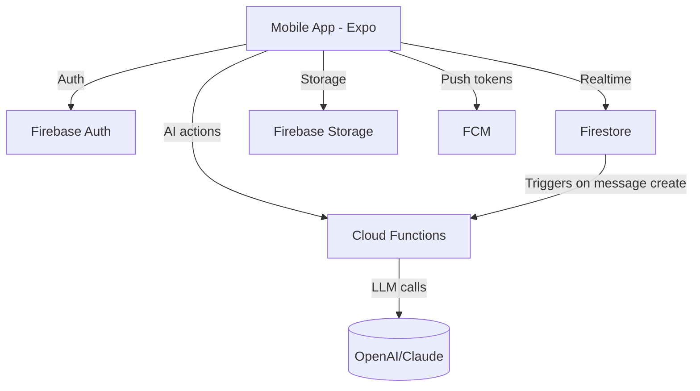
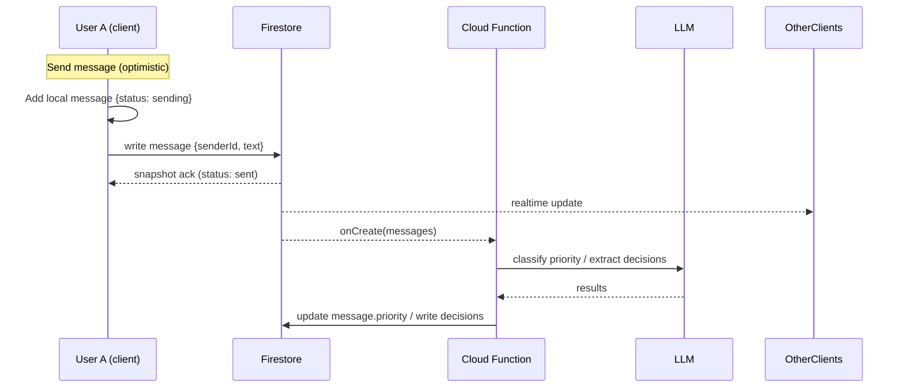
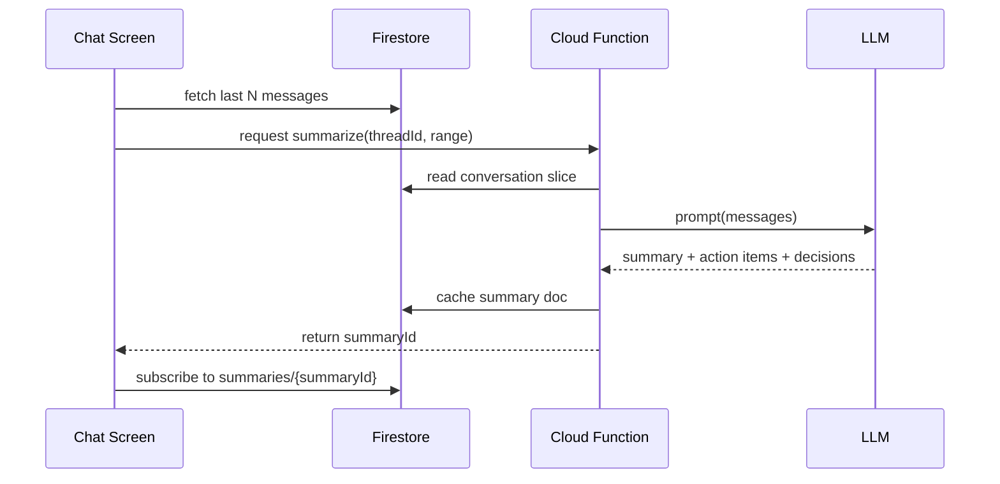
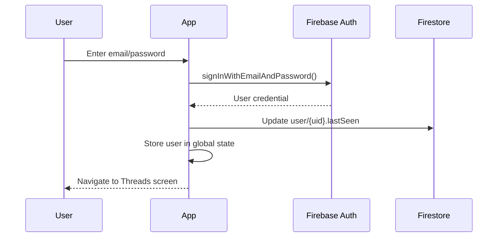
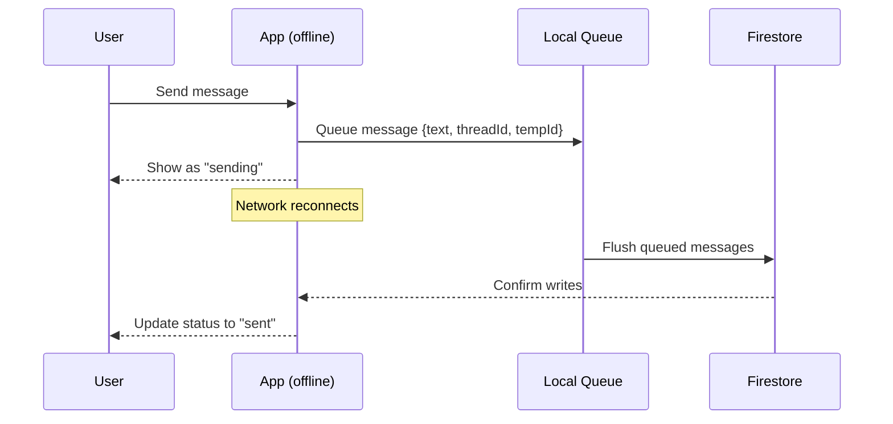
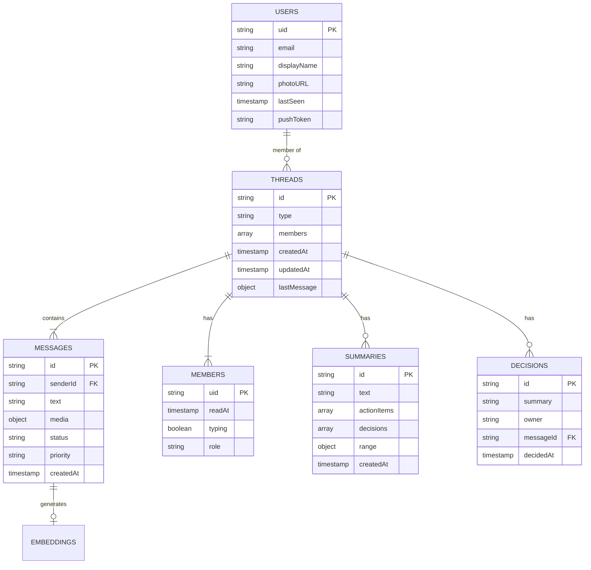
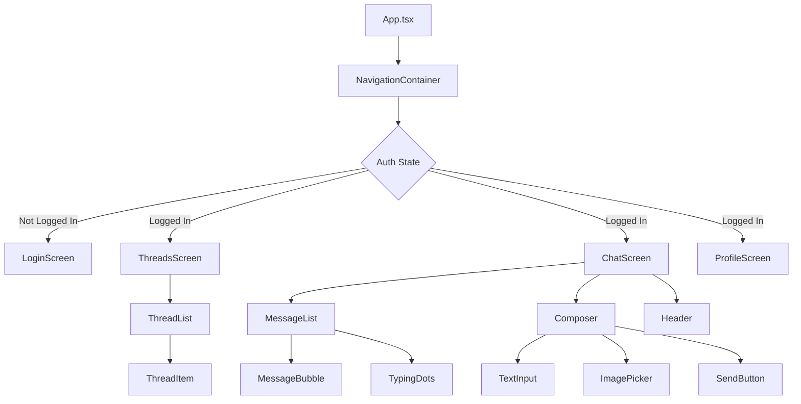
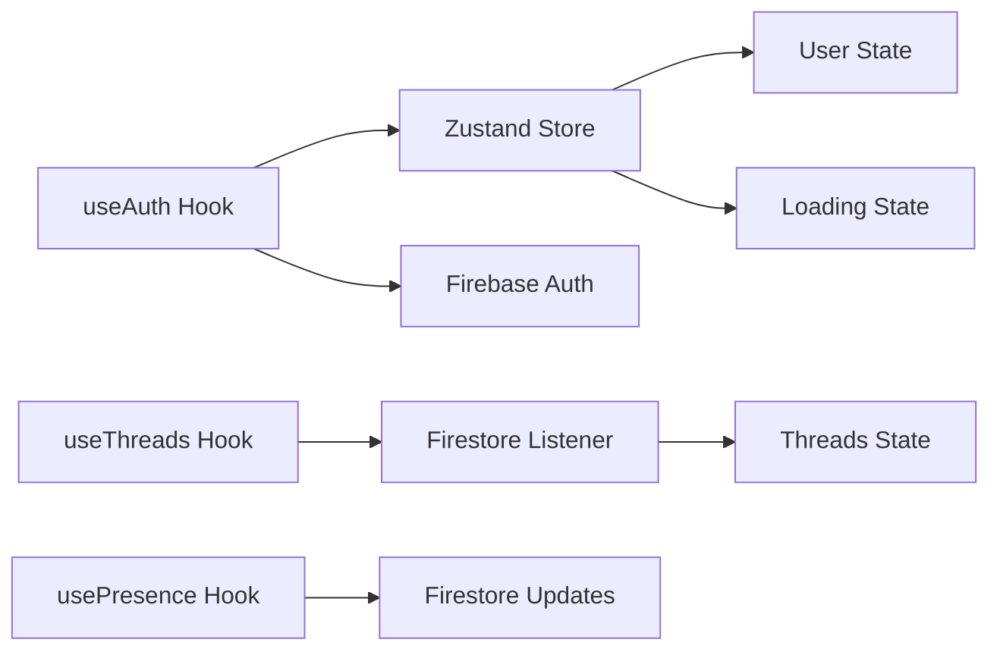
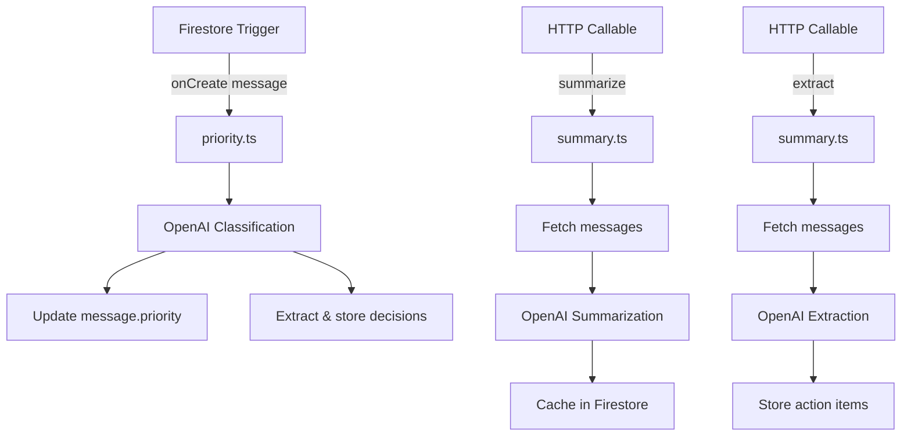
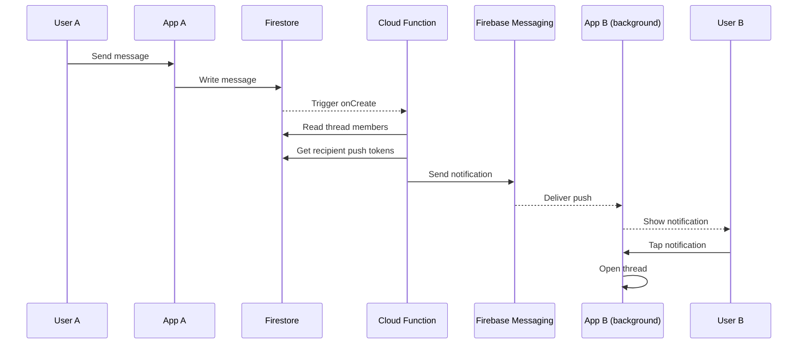

# MessageAI Architecture Diagrams

## System Overview

## Message Flow

## AI Summarization Flow

## Authentication Flow

## Offline Message Queue

## Data Model

## Component Hierarchy

## State Management

## Cloud Functions Architecture

## Push Notification Flow

