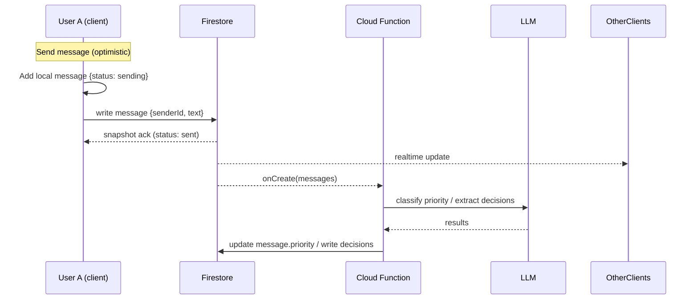
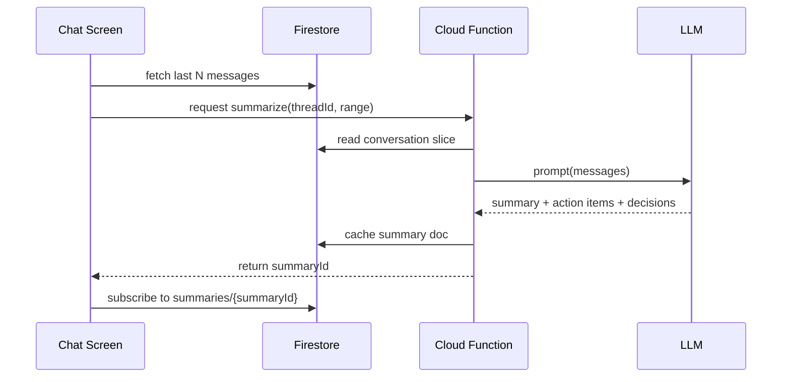

# MessageAI Kickstart Pack

A ready-to-port starter: product spec (PRD), architecture diagrams (mermaid.md), and an initial React Native + Firebase codebase scaffold with AI hooks. Copy/paste into Cursor as a new repo and iterate.

---

## 0) Why this direction (fastest path to MVP + AI)
- **Platform**: **React Native (Expo)** → fastest to ship cross‑platform, easy device testing with Expo Go.
- **Backend**: **Firebase (Auth, Firestore, Storage, FCM, Cloud Functions)** → real‑time sync, offline cache, push, and secure AI key handling in Functions.
- **AI**: **Cloud Functions → OpenAI/Claude**. Use function-calling style prompts and shallow RAG over recent conversation windows stored in Firestore.
- **Persona**: **Remote Team Professional** (SWEs/PMs/designers). You are already living this use case, and it’s the most straightforward to implement accurately in a week.
  - **Required 5**: Thread summarization, Action-item extraction, Smart search, Priority message detection, Decision tracking
  - **Advanced** (pick 1): **Proactive Assistant** → Detects meetings/decisions, suggests times (stub Google Calendar integration or mock for demo).

This stack maximizes your odds of clearing the Tuesday hard gate and gives you a credible runway to Friday/Sunday AI polish without getting blocked on native push certs or server ops.

---

## 1) PRD — MessageAI (Remote Team Professional)

### 1.1 Objective
Build a reliable, real-time chat app (1:1 + groups) with offline support and push, then layer AI that reduces thread overload for distributed teams.

### 1.2 Users & Persona
- **Primary**: Remote software teams (engineers, PMs, designers)
- **Jobs To Be Done**
  1) Stay on top of busy threads without reading everything
  2) Capture/track decisions and action items from chat
  3) Quickly find critical context
  4) Stop missing important pings across time zones

### 1.3 MVP (24h) — Acceptance Criteria ✅ COMPLETED
- Accounts: Email/Password Auth (Firebase Auth) ✅
- Chats: 1:1 + Group (3+ users) ✅
- Real-time delivery via Firestore snapshot listeners ✅
- **Optimistic send** with local pending state → confirmed by server ✅
- **Persistence** across restarts (Firestore offline cache + AsyncStorage queue) ✅
- **Offline queue** with automatic retry and media upload support ✅
- Presence: online/offline (Firestore `lastSeen`), typing indicators ✅
- Read receipts (per-user `lastRead` timestamp in thread doc) ✅
- Timestamps; message status: sending/sent/delivered/read ✅
- Foreground push via Expo Notifications (FCM for Android) ✅
- Deployed backend (Firebase project). Mobile runs in Expo Go ✅

### 1.4 Early Submission (4 days) ✅ COMPLETED
- Media: image send/receive (Firebase Storage, signed URLs) ✅
- Audio messages with playback controls ✅
- Profile pics & display names ✅
- Basic search (client-side over recent messages) ✅
- AI v1 (thread summary + action items on demand) ✅
- Group management (add/remove) ✅
- Performance testing (LoadTest screen with metrics) ✅
- Offline media queue (images and audio upload when reconnected) ✅

### 1.5 Final (7 days)
- All 5 AI features (below)
- One Advanced feature (Proactive Assistant)
- Smart search with simple vector embedding or keyword index
- Robust offline queue + conflict resolution
- Polished demo flows covering required test scenarios

### 1.6 AI Features (required 5)
1) **Thread Summarization**
   - On thread screen: “Summarize last N messages” → Cloud Function calls LLM with recent context; stores result in `threads/{id}/summaries/{ts}` for caching.
2) **Action‑Item Extraction**
   - Same call or separate tool: returns list of assignee, task, due (if any).
3) **Smart Search**
   - v1 keyword over message text; v2: optional embeddings (Functions + Firestore collection `embeddings` with `messageId`, `threadId`, vector via OpenAI Embeddings).
4) **Priority Message Detection**
   - LLM classifies new messages (Function triggered by Firestore onCreate) → sets `priority: high|normal` using lightweight heuristics (mentions, decisions, tags). High priority triggers push with a different channel.
5) **Decision Tracking**
   - LLM extracts decisions; writes to `threads/{id}/decisions/{doc}` with `summary`, `who`, `when`, `links`.

### 1.7 Advanced Feature — Proactive Assistant
- Cloud Function periodically (or on message create) scans recent messages for:
  - “Schedule” intent, date/time entities, blockers
  - Suggests 2–3 time windows (mock calendar availability or integrate Google Calendar if time permits)
- Surfaces inline suggestion chip → tap to post as message draft.

### 1.8 Non‑Goals
- E2E encryption (beyond Firebase transport & rules) this week
- Voice/Video calls
- Heavy desktop/web client

### 1.9 Success Metrics
- Reliability: 0 lost messages in test script; round‑trip < 400ms on good network
- Offline: messages queued and delivered on reconnect; no UI freezes
- AI utility: Users report ≥2 useful summaries/extractions during demo

### 1.10 Risks & Mitigations
- **Push setup pain** → Use Expo’s FCM/APNs helpers; foreground first
- **AI latency** → Cache summaries, limit context window, stream partial results
- **Costs** → Truncate context (last 50 msgs), nightly cleanup

---

## 2) Architecture & Data Model

### 2.1 Collections (Firestore)
```
users: {
  uid,
  email,
  displayName,
  photoURL,
  lastSeen: Timestamp,
  pushToken,
}

threads: {
  id,
  type: 'direct'|'group',
  members: [uid...],
  createdAt,
  updatedAt,
  lastMessage,
}

threadMembers: { // subcollection: threads/{id}/members/{uid}
  role: 'admin'|'member',
  joinedAt,
  readAt: Timestamp, // last read time for receipts
  typing: boolean,
}

messages: { // subcollection: threads/{id}/messages/{mid}
  id,
  senderId,
  text,
  media: { type: 'image'|null, url: string|null, width, height },
  status: 'sending'|'sent'|'delivered'|'read',
  priority: 'high'|'normal',
  createdAt,
}

summaries: { // threads/{id}/summaries/{sid}
  range: { from: Timestamp, to: Timestamp },
  text,
  actionItems: [{assignee, task, due}],
  decisions: [{summary, owner, decidedAt}],
  createdAt,
}

embeddings (optional): {
  messageId,
  threadId,
  vector: number[], // if using vector search elsewhere
}
```

### 2.2 Security (outline)
- Rules: user must be in `threads/{id}.members` to read/write
- `messages.create`: `request.auth.uid` ∈ members, server sets authoritative `createdAt`
- Cloud Function validates/filters `priority` status, not client

### 2.3 Presence
- `users/{uid}.lastSeen` updated on app focus/blur; optional Realtime DB for ephemeral `online`.

---

## 3) mermaid.md (copy into /docs/mermaid.md)

```mermaid
flowchart TD
  A[Mobile App (Expo)] -->|Auth| B[Firebase Auth]
  A -->|Realtime| C[Firestore]
  A -->|Storage| D[Firebase Storage]
  A -->|Push tokens| E[FCM]
  A -->|AI actions| F[Cloud Functions]
  F -->|LLM calls| G[(OpenAI/Claude)]
  C -->|Triggers on message create| F
```





---

## 4) Initial Codebase (copy into a new repo)

### 4.1 File Tree
```
messageai/
  app.json
  app.config.ts
  package.json
  metro.config.js
  App.tsx
  src/
    screens/
      LoginScreen.tsx
      ThreadsScreen.tsx
      ChatScreen.tsx
      ProfileScreen.tsx
    components/
      MessageBubble.tsx
      Composer.tsx
      TypingDots.tsx
    hooks/
      useAuth.ts
      useThread.ts
      usePresence.ts
    services/
      firebase.ts
      storage.ts
      notifications.ts
      ai.ts  // client stubs calling Functions
    state/
      store.ts
      offlineQueue.ts
    utils/
      time.ts
  firebase/
    firestore.rules
    functions/
      package.json
      tsconfig.json
      src/index.ts
      src/ai.ts
      src/priority.ts
      src/summary.ts
  docs/
    mermaid.md
    PRD.md
    README.md
```

### 4.2 package.json (root)
```json
{
  "name": "messageai",
  "version": "0.1.0",
  "private": true,
  "main": "./node_modules/expo/AppEntry.js",
  "scripts": {
    "start": "expo start",
    "android": "expo run:android",
    "ios": "expo run:ios",
    "web": "expo start --web"
  },
  "dependencies": {
    "expo": "~51.0.0",
    "react": "18.2.0",
    "react-native": "0.74.0",
    "expo-router": "^3.5.0",
    "expo-notifications": "~0.28.0",
    "expo-image-picker": "~15.0.5",
    "firebase": "^10.12.2",
    "zustand": "^4.5.2",
    "dayjs": "^1.11.11"
  },
  "devDependencies": {
    "typescript": "^5.4.0"
  }
}
```

### 4.3 src/services/firebase.ts
```ts
import { initializeApp } from 'firebase/app';
import { getAuth } from 'firebase/auth';
import { getFirestore, enableIndexedDbPersistence } from 'firebase/firestore';
import { getStorage } from 'firebase/storage';

const firebaseConfig = {
  apiKey: process.env.EXPO_PUBLIC_FB_API_KEY,
  authDomain: process.env.EXPO_PUBLIC_FB_AUTH_DOMAIN,
  projectId: process.env.EXPO_PUBLIC_FB_PROJECT_ID,
  storageBucket: process.env.EXPO_PUBLIC_FB_STORAGE_BUCKET,
  messagingSenderId: process.env.EXPO_PUBLIC_FB_SENDER_ID,
  appId: process.env.EXPO_PUBLIC_FB_APP_ID
};

const app = initializeApp(firebaseConfig);
export const auth = getAuth(app);
export const db = getFirestore(app);
export const storage = getStorage(app);

// Offline persistence
enableIndexedDbPersistence(db).catch(() => {/* already enabled or unsupported */});
```

### 4.4 src/state/offlineQueue.ts (optimistic send)
```ts
import { addDoc, collection, serverTimestamp } from 'firebase/firestore';
import { db } from '../services/firebase';

type Pending = { threadId: string; text?: string; media?: any; tempId: string };

export async function sendMessageOptimistic(p: Pending, uid: string) {
  const { threadId, text, media, tempId } = p;
  // Client writes; serverTimestamp becomes authoritative
  await addDoc(collection(db, `threads/${threadId}/messages`), {
    senderId: uid,
    text: text ?? '',
    media: media ?? null,
    status: 'sent',
    createdAt: serverTimestamp()
  });
}
```

### 4.5 src/screens/ChatScreen.tsx (minimal realtime thread)
```tsx
import { useEffect, useRef, useState } from 'react';
import { FlatList, View } from 'react-native';
import { collection, onSnapshot, orderBy, query } from 'firebase/firestore';
import { db } from '../services/firebase';
import Composer from '../components/Composer';
import MessageBubble from '../components/MessageBubble';

export default function ChatScreen({ route }) {
  const { threadId, uid } = route.params;
  const [messages, setMessages] = useState<any[]>([]);
  const listRef = useRef<FlatList>(null);

  useEffect(() => {
    const q = query(collection(db, `threads/${threadId}/messages`), orderBy('createdAt','asc'));
    const unsub = onSnapshot(q, snap => {
      const rows = snap.docs.map(d => ({ id: d.id, ...d.data() }));
      setMessages(rows);
      requestAnimationFrame(() => listRef.current?.scrollToEnd({ animated: true }));
    });
    return () => unsub();
  }, [threadId]);

  return (
    <View style={{ flex: 1 }}>
      <FlatList ref={listRef} data={messages} keyExtractor={i => i.id}
        renderItem={({ item }) => <MessageBubble item={item} me={uid} />} />
      <Composer threadId={threadId} uid={uid} />
    </View>
  );
}
```

### 4.6 src/components/Composer.tsx
```tsx
import { useState } from 'react';
import { View, TextInput, Button } from 'react-native';
import { sendMessageOptimistic } from '../state/offlineQueue';

export default function Composer({ threadId, uid }) {
  const [text, setText] = useState('');
  return (
    <View style={{ flexDirection: 'row', padding: 8 }}>
      <TextInput
        style={{ flex: 1, borderWidth: 1, borderRadius: 8, padding: 8 }}
        value={text}
        onChangeText={setText}
        placeholder="Message"
      />
      <Button title="Send" onPress={async () => {
        if (!text.trim()) return;
        const tempId = `${Date.now()}`;
        await sendMessageOptimistic({ threadId, text, tempId }, uid);
        setText('');
      }} />
    </View>
  );
}
```

### 4.7 src/services/notifications.ts (register for push)
```ts
import * as Notifications from 'expo-notifications';
import { Platform } from 'react-native';

export async function registerForPush(): Promise<string | null> {
  const { status } = await Notifications.requestPermissionsAsync();
  if (status !== 'granted') return null;
  const token = (await Notifications.getExpoPushTokenAsync()).data;
  if (Platform.OS === 'android') {
    await Notifications.setNotificationChannelAsync('default', { name: 'default', importance: Notifications.AndroidImportance.DEFAULT });
  }
  return token;
}
```

### 4.8 firebase/functions/src/index.ts (Functions entry)
```ts
import * as functions from 'firebase-functions';
import { onMessageCreate } from './priority';
import { summarizeThread, extractAI } from './summary';

export const messageCreated = functions.firestore
  .document('threads/{threadId}/messages/{messageId}')
  .onCreate(onMessageCreate);

export const summarize = functions.https.onCall(summarizeThread);
export const extract = functions.https.onCall(extractAI);
```

### 4.9 firebase/functions/src/summary.ts (LLM calls)
```ts
import { getFirestore } from 'firebase-admin/firestore';
import OpenAI from 'openai';
import * as admin from 'firebase-admin';

if (!admin.apps.length) admin.initializeApp();
const db = getFirestore();
const openai = new OpenAI({ apiKey: process.env.OPENAI_API_KEY });

export const summarizeThread = async (req: any) => {
  const { threadId, limit = 50 } = req.data || {};
  const snap = await db.collection(`threads/${threadId}/messages`).orderBy('createdAt','desc').limit(limit).get();
  const msgs = snap.docs.reverse().map(d => d.data());
  const prompt = `Summarize the conversation for a remote team. Include key points, decisions, and action items with assignees/dates if present.\nMessages:${JSON.stringify(msgs).slice(0,6000)}`;
  const res = await openai.chat.completions.create({
    model: 'gpt-4o-mini',
    messages: [{ role: 'user', content: prompt }]
  });
  const text = res.choices[0].message?.content ?? '';
  const out = { text, createdAt: admin.firestore.FieldValue.serverTimestamp() };
  const ref = await db.collection(`threads/${threadId}/summaries`).add(out);
  return { summaryId: ref.id };
};

export const extractAI = async (req: any) => {
  const { threadId, limit = 50 } = req.data || {};
  const snap = await db.collection(`threads/${threadId}/messages`).orderBy('createdAt','desc').limit(limit).get();
  const msgs = snap.docs.reverse().map(d => d.data());
  const prompt = `From the chat, extract:\n- Action items as JSON {assignee, task, due}\n- Decisions as JSON {summary, owner, decidedAt}\nReturn JSON with keys actionItems and decisions. Messages:${JSON.stringify(msgs).slice(0,6000)}`;
  const res = await openai.chat.completions.create({
    model: 'gpt-4o-mini',
    messages: [{ role: 'user', content: prompt }],
    response_format: { type: 'json_object' }
  });
  const parsed = JSON.parse(res.choices[0].message?.content ?? '{"actionItems":[],"decisions":[]}');
  await db.collection(`threads/${threadId}/summaries`).add({
    createdAt: admin.firestore.FieldValue.serverTimestamp(),
    ...parsed
  });
  return parsed;
};
```

### 4.10 firebase/functions/src/priority.ts (priority + decisions on message create)
```ts
import { getFirestore } from 'firebase-admin/firestore';
import * as admin from 'firebase-admin';
import OpenAI from 'openai';

if (!admin.apps.length) admin.initializeApp();
const db = getFirestore();
const openai = new OpenAI({ apiKey: process.env.OPENAI_API_KEY });

export const onMessageCreate = async (snap: any, context: any) => {
  const message = snap.data();
  const { threadId } = context.params;
  const prompt = `Classify the priority of this message for a remote team as HIGH or NORMAL, and extract any decision statements succinctly. Return JSON {priority:"high|normal", decisions:[{summary, owner?}]}. Msg:${JSON.stringify(message).slice(0,2000)}`;
  const res = await openai.chat.completions.create({
    model: 'gpt-4o-mini',
    messages: [{ role: 'user', content: prompt }],
    response_format: { type: 'json_object' }
  });
  const out = JSON.parse(res.choices[0].message?.content ?? '{"priority":"normal","decisions":[]}');
  await snap.ref.update({ priority: out.priority });
  if (out.decisions?.length) {
    const batch = db.batch();
    out.decisions.forEach((d: any) => {
      const ref = db.collection(`threads/${threadId}/decisions`).doc();
      batch.set(ref, { ...d, createdAt: admin.firestore.FieldValue.serverTimestamp() });
    });
    await batch.commit();
  }
};
```

### 4.11 firebase/firestore.rules (very light sketch – tighten later)
```js
rules_version = '2';
service cloud.firestore {
  match /databases/{database}/documents {
    match /users/{uid} {
      allow read: if request.auth != null;
      allow write: if request.auth.uid == uid;
    }
    match /threads/{threadId} {
      allow read, write: if request.auth != null && request.auth.uid in resource.data.members;
      match /messages/{messageId} {
        allow read, write: if request.auth != null && request.auth.uid in get(/databases/$(database)/documents/threads/$(threadId)).data.members;
      }
      match /members/{uid} {
        allow read, write: if request.auth != null && request.auth.uid in get(/databases/$(database)/documents/threads/$(threadId)).data.members;
      }
      match /summaries/{sid} { allow read: if request.auth != null && request.auth.uid in get(/databases/$(database)/documents/threads/$(threadId)).data.members; }
      match /decisions/{did} { allow read: if request.auth != null && request.auth.uid in get(/databases/$(database)/documents/threads/$(threadId)).data.members; }
    }
  }
}
```

### 4.12 docs/README.md (setup)
```md
# MessageAI Setup

## Firebase
1. Create a Firebase project; enable Auth (Email/Password), Firestore, Storage, Functions.
2. Create a web app; copy config into `.env` or `app.config.ts` via EXPO_PUBLIC_* vars.
3. `firebase login && firebase init` (select Firestore, Functions, Hosting optional).
4. In `firebase/functions`, set `OPENAI_API_KEY` runtime config:
   ```
   firebase functions:config:set openai.key="YOUR_KEY"
   ```
   or use environment variables in your CI.

## App
```bash
npm i
npx expo prebuild  # if you’re building device binaries; Expo Go works without
npm run start
```

- Test on two devices with Expo Go; sign into two test accounts.
- Use Firestore console to create a `threads` doc with `members: [uid1, uid2]` then send messages.

## AI Calls
- `summarize` and `extract` are callable functions; from client, use Firebase Functions SDK (or REST) to invoke.

## Push
- Use `expo-notifications`; on first run, store the returned token under `users/{uid}.pushToken` for targeting.
```

---

## 5) Demo Script (aligns to graders’ scenarios)
1) Two devices chatting live in a 1:1 thread
2) Toggle airplane mode on device B → send A→B → reconnect B → messages flush
3) Background the app → send high‑priority message → foreground shows push & badge
4) Force quit and reopen → history intact
5) Rapid fire: paste 20 quick messages from A → confirm ordering & delivery
6) Group chat (3 users) → show read receipts per member
7) AI: tap “Summarize last 50” → renders summary/action items + decisions; show priority chips

---

## 6) Open Questions / Options
- **Embeddings for search**: optional for final; fallback = keyword search
- **Presence source**: Firestore `lastSeen` vs Realtime Database ephemeral presence (RTDB smoother but adds a service)
- **Advanced feature**: Proactive assistant suggesting meeting times → mock calendar vs real Google Calendar OAuth (time‑boxed)
- **Media**: images first, video later

---

## 7) Next Steps (today)
- Create Firebase project + paste config
- Seed 1:1 thread and verify real-time flow
- Wire `summarize` callable + UI button
- Add read receipts (`threadMembers/{uid}.readAt`) update on view
- Add simple presence (`users/{uid}.lastSeen` on focus/blur)

You’re unblocked. Port this into Cursor, run Expo, and we’ll iterate UI polish + AI prompts once the pipe is solid.

